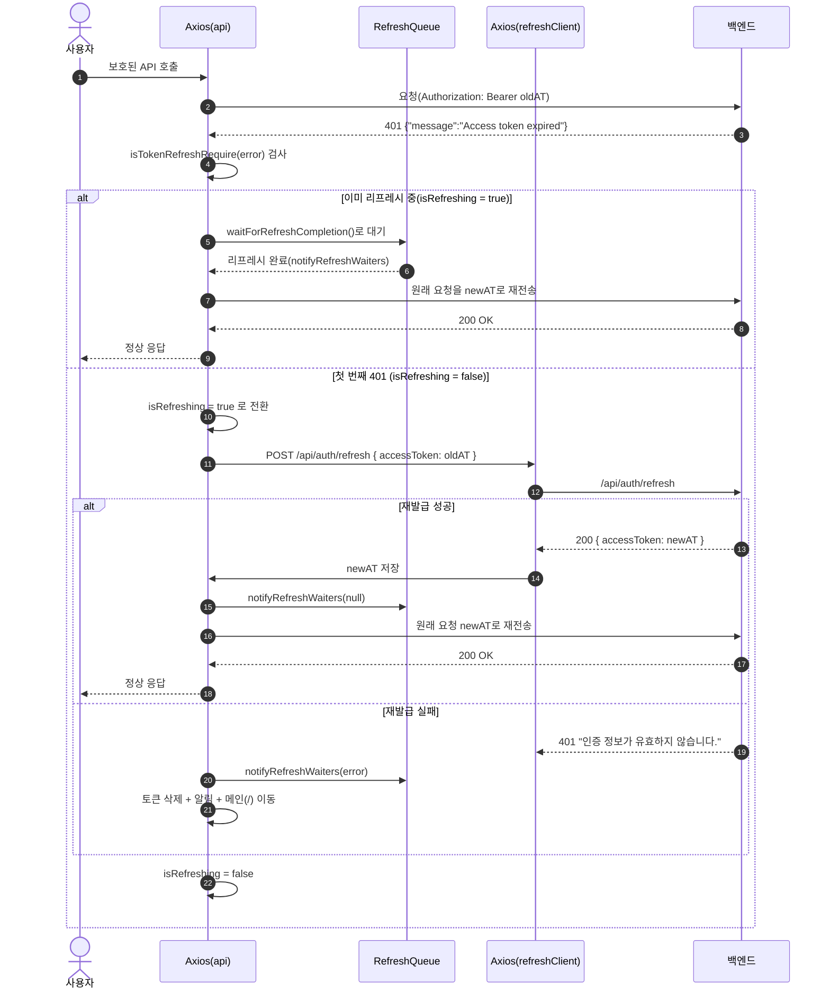

# Axios 기반 Access Token 재발급 구조 (응답 인터셉터 · 리프레시 큐)

> MindMate 프론트엔드에서 구현한 **Access Token 자동 재발급 구조**를 정리한 문서이다.
> 백엔드의 JWT/Redis 전략(`auth-jwt` 문서)을 전제로,
> Axios 인스턴스, 응답 인터셉터, 리프레시 큐 동작을 프론트 관점에서 설명한다.

---

## 1. 개요

프론트는 모든 보호된 API 요청에 **Access Token(AT)** 을 `Authorization` 헤더에 실어서 보낸다.

-   AT가 유효하면 그대로 200 응답을 사용한다.
-   AT가 만료되면 백엔드는
    `401 {"message":"Access token expired"}` 를 내려준다.
-   Axios 응답 인터셉터가 이 응답을 감지해
    `/api/auth/refresh` 로 **자동 재발급 요청**을 보낸다.
-   재발급 성공 시:

    -   새 AT를 저장한다.
    -   실패했던 원래 요청을 새 AT로 다시 보낸다.

-   재발급 실패 시:

    -   저장된 토큰을 모두 삭제한다.
    -   알림 후 메인(/)으로 이동, 재로그인을 유도한다.

---

## 2. 전체 동작 흐름

### 2.1 시나리오 요약

1. 보호된 API 호출 → `Authorization: Bearer <AT>`
2. 백엔드 필터에서 AT 만료 → `401 {"message":"Access token expired"}`
3. Axios 응답 인터셉터에서:

    - “재발급 대상 요청인지” 검사
    - 대상이라면 `/api/auth/refresh` 호출

4. `/api/auth/refresh` 성공:

    - 새 AT 저장
    - 원래 요청을 새 AT로 재시도

5. `/api/auth/refresh` 실패:

    - AT/RT 제거
    - 알림 후 메인 페이지로 이동 → 로그인 다시 진행

### 2.2 순서 그림



---

## 3. Axios 인스턴스 기본 구조

### 3.1 공통 API 인스턴스

```ts
import axios from "axios";

const API_BASE_URL = process.env.REACT_APP_API_BASE_URL ?? "/";

export const ACCESS_KEY = "accessToken";

export const getAccessToken = () => localStorage.getItem(ACCESS_KEY);
export const setAccessToken = (token: string) =>
    localStorage.setItem(ACCESS_KEY, token);
export const clearTokens = () => {
    localStorage.removeItem(ACCESS_KEY);
    // 필요 시, 추가 클리어 로직 (유저 정보, 상태 등)
};

export const api = axios.create({
    baseURL: API_BASE_URL,
    withCredentials: true, // refreshToken 쿠키 자동 전송
});
```

### 3.2 refresh 전용 인스턴스

-   재발급 요청에서는 **응답 인터셉터 재귀 호출**을 막기 위해
    별도 인스턴스를 사용한다.

```ts
export const refreshClient = axios.create({
    baseURL: API_BASE_URL,
    withCredentials: true,
});
```

---

## 4. 재발급 대상 여부 판별 함수

### 4.1 isTokenRefreshRequire

```ts
const isTokenRefreshRequire = (error: any) => {
    if (!error?.response) return false;

    const originalRequest = error.config || {};
    const statusCode = error.response.status;
    const url: string = originalRequest?.url || "";

    // 리프레시 요청 자체에서 401이 난 경우는 재시도하지 않는다.
    const isFromRefresh = url.includes("/api/auth/refresh");

    // 이미 한 번 재시도한 요청이면(_retry 플래그) 다시 재발급 시도 X
    const firstTime = !originalRequest?._retry;

    // Authorization 헤더가 있었던 요청만 리프레시 대상
    const headers = originalRequest.headers || {};
    const authHeader =
        headers.Authorization ||
        headers.authorization ||
        ""; /* 일부 브라우저 호환 */
    const hasAuthHeader = typeof authHeader === "string" && !!authHeader;

    // 백엔드에서 내려준 message 값 기준
    const message = error.response.data?.message;
    const isAccessTokenExpired = message === "Access token expired";

    return (
        statusCode === 401 &&
        firstTime &&
        !isFromRefresh &&
        hasAuthHeader &&
        isAccessTokenExpired
    );
};
```

**의미**

-   반드시 다음 조건을 모두 만족해야 재발급 시도:

    -   HTTP Status = 401
    -   `{"message":"Access token expired"}` 일 때만 (위조/형식 오류는 제외)
    -   첫 실패(`_retry` 플래그 없음)
    -   `/api/auth/refresh` 가 아닌 요청
    -   `Authorization` 헤더가 있던 요청

---

## 5. 리프레시 큐 구조

동시에 여러 요청이 401을 맞더라도, **리프레시 호출은 단 한 번만** 나가도록 설계한다.

### 5.1 상태 변수

```ts
let isRefreshing = false;

type RefreshWaiter = {
    resolve: () => void;
    reject: (error: any) => void;
};

let refreshWaitQueue: RefreshWaiter[] = [];
```

### 5.2 대기/알림 유틸

```ts
const waitForRefreshCompletion = () =>
    new Promise<void>((resolve, reject) => {
        refreshWaitQueue.push({ resolve, reject });
    });

const notifyRefreshWaiters = (error?: any) => {
    refreshWaitQueue.forEach(({ resolve, reject }) => {
        if (error) reject(error);
        else resolve();
    });
    refreshWaitQueue = [];
};
```

**동작**

-   이미 `isRefreshing === true` 인 상태에서 또 401이 발생하면,

    -   `waitForRefreshCompletion()` 에 등록 → 리프레시 완료까지 `await` 대기

-   리프레시 완료 후:

    -   `notifyRefreshWaiters(null)` 로 모든 대기 요청 깨우기
    -   각 요청은 새 AT를 읽어서 자신을 다시 보냄

---

## 6. Axios 응답 인터셉터

### 6.1 전체 코드

```ts
api.interceptors.response.use(
    (res) => res,
    async (error) => {
        // 재발급 대상이 아니면 그대로 에러 반환
        if (!isTokenRefreshRequire(error)) {
            return Promise.reject(error);
        }

        const originalRequest = error.config;
        originalRequest._retry = true; // 한 번 재시도 했음을 표시

        // 이미 다른 리프레시 요청이 진행 중이면, 그 결과를 기다렸다가 재시도
        if (isRefreshing) {
            try {
                await waitForRefreshCompletion();

                const token = getAccessToken();
                if (!token) {
                    return Promise.reject(error);
                }

                originalRequest.headers = {
                    ...(originalRequest.headers || {}),
                    Authorization: `Bearer ${token}`,
                };

                return api(originalRequest);
            } catch (e) {
                return Promise.reject(e);
            }
        }

        // 여기까지 왔다면, 지금 이 요청이 "리프레시를 처음 시작하는" 주체
        isRefreshing = true;

        try {
            const accessToken = getAccessToken();
            if (!accessToken) {
                throw new Error("No access token stored");
            }

            // refreshClient 로 재발급 요청
            const { data } = await refreshClient.post("/api/auth/refresh", {
                accessToken,
            });

            const newAccessToken = data?.accessToken;
            if (!newAccessToken) {
                throw new Error("No access token in response");
            }

            // 새 토큰 저장
            setAccessToken(newAccessToken);

            // 대기 중이던 요청들에게 "성공" 알림
            notifyRefreshWaiters(null);

            // 현재 원래 요청에도 새 토큰 세팅 후 재시도
            originalRequest.headers = {
                ...(originalRequest.headers || {}),
                Authorization: `Bearer ${newAccessToken}`,
            };

            return api(originalRequest);
        } catch (e) {
            // 리프레시 실패: 토큰 제거 + 대기 중인 요청들에도 실패 알림
            clearTokens();
            notifyRefreshWaiters(e);

            // UX 정책: 알림 후 메인(/)으로 이동
            alert("로그인이 만료되었습니다. 다시 로그인 해주세요.");
            window.location.replace("/");

            return Promise.reject(e);
        } finally {
            isRefreshing = false;
        }
    }
);
```

---

## 7. 토큰 유틸 및 사용자 정보 조회

### 7.1 토큰 유틸 함수

```ts
export const getAccessToken = () => localStorage.getItem(ACCESS_KEY);

export const setAccessToken = (token: string) =>
    localStorage.setItem(ACCESS_KEY, token);

export const clearTokens = () => {
    localStorage.removeItem(ACCESS_KEY);
    // 필요 시, 유저 정보나 기타 상태도 함께 초기화
};
```

### 7.2 현재 로그인된 유저 조회 예시

```ts
export const getUser = async () => {
    const accessToken = getAccessToken();
    if (!accessToken) return null;

    try {
        const res = await api.get("/api/auth/me", {
            headers: { Authorization: `Bearer ${accessToken}` },
        });
        return res.data;
    } catch (err) {
        return null;
    }
};
```

-   여기서도 `api` 인스턴스를 사용하므로,

    -   AT 만료 시 동일한 재발급 로직이 적용된다.

---

## 8. 에러 및 UX 처리 규칙

### 8.1 401 분기 기준

-   `{"message":"Access token expired"}`:

    -   Axios 인터셉터에서 재발급 시도.

-   `{"message":"Invalid token"}` 또는 다른 메시지:

    -   재발급 대상 아님 → 일반 에러 처리(로그아웃/알림 등).

### 8.2 재발급 실패 시 공통 처리

-   `clearTokens()` 호출 → 로컬 AT 제거

-   서버에서도 RT/Redis 엔티티가 삭제되어 있음(JWT 문서 참고)

-   사용자에게 알림:

    ```ts
    alert("로그인이 만료되었습니다. 다시 로그인 해주세요.");
    window.location.replace("/");
    ```

-   결과적으로:

    -   서버/클라이언트 모두에서 인증 상태가 **완전히 초기화된 상태**가 된다.

---

## 9. `/api/auth/refresh` 연동 규칙 정리

-   Method: `POST`

-   Body:

    ```json
    { "accessToken": "<oldAccessToken>" }
    ```

-   Cookie:

    -   `refreshToken=<RT>` (브라우저가 자동으로 전송)

-   성공(200):

    ```json
    { "accessToken": "<newAccessToken>" }
    ```

-   실패(401, `"인증 정보가 유효하지 않습니다."`):

    -   Axios 인터셉터에서 재로그인 유도

---

## 10. 회고 · 개선 포인트

-   프론트에서 **리프레시 큐**를 도입해,

    -   동시에 여러 요청이 401을 맞더라도
    -   `/api/auth/refresh` 는 **항상 한 번만** 나가도록 만들었다.

-   백엔드의 `"Access token expired"` / `"Invalid token"` 구분과 맞춰,

    -   만료에만 재발급을 시도하고
    -   나머지는 바로 로그아웃 처리하게 했다.

-   재발급 실패 시:

    -   서버: RT 엔티티 삭제 + RT 쿠키 삭제
    -   클라이언트: AT 삭제 + 메인 이동
        → “애매한 반로그인 상태”를 남기지 않고 **명확한 로그아웃 상태**로 정리된다.

향후 개선 아이디어:

-   재발급 실패 시, 현재 경로를 기억했다가
    로그인 성공 후 원래 페이지로 복귀시키는 로직 추가
-   AT 저장 위치를 localStorage 대신 **메모리 + refresh-only 쿠키** 구조로 변경해 XSS 리스크 감소
-   재발급 중인 상태를 전역 상태(예: Recoil/Zustand 등)에 노출해,
    버튼 비활성화나 로딩 인디케이터를 띄우는 UX 개선
