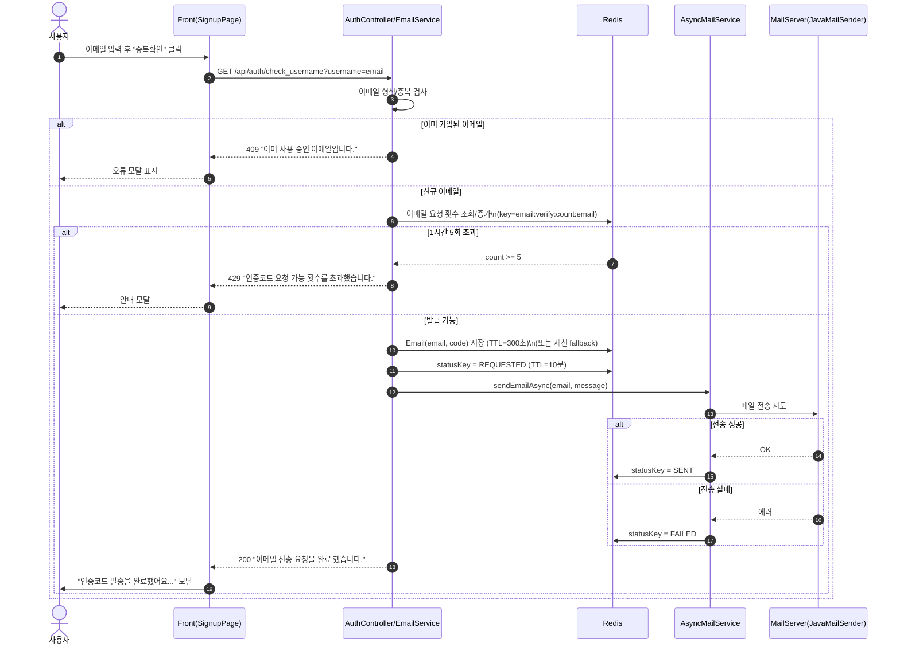
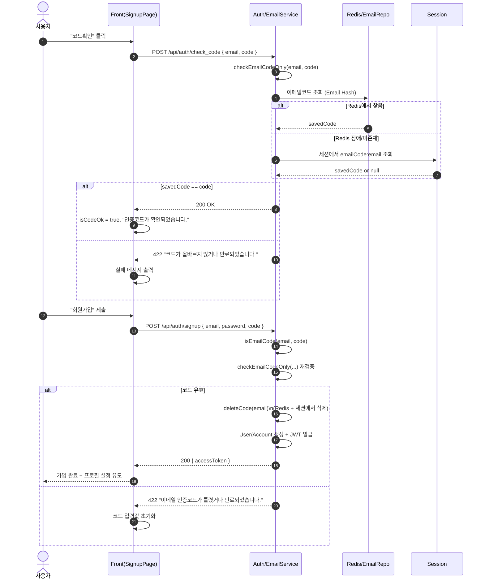

# 이메일 인증 시스템 (코드 발급 · 검증 · Redis + 세션 Fallback)

> MindMate 회원가입에서 사용하는 **이메일 인증 코드 시스템**을 정리한 문서이다.  
> 이메일 중복 체크, 인증코드 발급/검증, **Redis 기반 요청 제한 + 상태 관리**,  
> Redis 장애 시 **세션 fallback**까지 전체 흐름을 설명한다.  
> JWT / Refresh Token 구조는 `auth-jwt-flow-redis.md` 문서를 전제로 한다.

---

## 1. 개요

이메일 인증 시스템의 목표:

-   가입 이메일의 **유일성 보장** (중복 가입 방지)
-   사용자가 **본인 이메일을 소유**하고 있는지 검증
-   인증 코드 요청을 **시간당 5회로 제한**해 악용 방지
-   이메일 전송을 **비동기 처리**해서 회원가입 UX 개선
-   Redis 장애 시에도 **가입 진행이 가능한 fallback 구조**

핵심 컴포넌트:

-   `EmailService`
    -   코드 생성/저장, 발송 요청, 검증/삭제, 요청 제한 로직
-   `AsyncMailService`
    -   JavaMailSender로 실제 메일 전송 (비동기)
    -   Redis에 전송 상태(`REQUESTED / SENT / FAILED`) 기록
-   `RedisService`
    -   `StringRedisTemplate` 래핑 (get/set/delete + TTL)
-   `Email` 엔티티 (`@RedisHash`)
    -   이메일 → 인증코드 매핑, TTL=300초(5분)
-   `RedisConfig`, `AsyncConfig`
    -   Redis 타임아웃 설정, `@EnableAsync` 비동기 활성화
-   프론트엔드
    -   `/api/auth/check_username` 호출로 **중복체크 + 인증코드 발급**
    -   `/api/auth/check_code`로 코드 1차 검증
    -   `/api/auth/signup`에서 코드 최종 검증 후 회원가입

---

## 2. 데이터 구조 & Redis 전략

### 2.1 인증코드 저장 (`Email` 엔티티)

```java
@RedisHash(value = "email", timeToLive = 300) // 300초 = 5분
public class Email {
    @Id
    private String email;
    private String code;
}
```

-   Key: 이메일 주소 (`email`)
-   Value: 6자리 숫자 코드 (`code`)
-   TTL: **300초(5분)**
    → 5분이 지나면 Redis에서 자동 삭제 → 코드 만료 처리와 동일

Redis 저장 실패 시에는 **세션에 동일 키로 저장**한다.

```java
Email emailEntity = new Email(email, code);
emailRepository.save(emailEntity); // Redis Hash

// 실패 시
HttpSession session = request.getSession(true);
session.setAttribute("emailCode:" + email, code);
```

---

### 2.2 요청 횟수 제한 (1시간 5회)

```java
private static final int MAX_REQUESTS_PER_HOUR = 5;
private static final String EMAIL_COUNT_KEY_PREFIX = "email:verify:count:";
```

-   Redis Key: `email:verify:count:{email}`
-   내용: 최근 1시간 내 요청 횟수 (정수)
-   TTL: **1시간**

로직:

```java
String key = EMAIL_COUNT_KEY_PREFIX + email;
String current = redisService.getData(key);
int count = (current == null) ? 0 : Integer.parseInt(current);

if (count >= MAX_REQUESTS_PER_HOUR) {
    return true; // 초과
}

int newCount = count + 1;
redisService.setDataExpire(key, String.valueOf(newCount), 60 * 60); // 1h
return false;
```

Redis 장애 시:

-   세션에 `emailCodeCount:{email}`로 카운트 저장
-   동일하게 `MAX_REQUESTS_PER_HOUR` 초과 시 제한

---

### 2.3 이메일 전송 상태 관리

```java
private static final String EMAIL_STATUS_KEY_PREFIX = "email:verify:status:";
private static final long EMAIL_STATUS_TTL_SECONDS = 60 * 10; // 10분
```

Redis Key: `email:verify:status:{email}`

값:

-   `"REQUESTED"` : 전송 요청 직후
-   `"SENT"` : JavaMailSender 전송 성공
-   `"FAILED"` : 전송 실패

TTL: **10분**

-   상태 조회: `getEmailStatus(email)`
-   상태 갱신:

    -   `EmailService.sendMailWithCode` 시작 시 → `"REQUESTED"`
    -   `AsyncMailService.sendEmailAsync` 성공 시 → `"SENT"`
    -   실패 시 → `"FAILED"`

> 현재 Signup UI에서는 상태 조회 API를 사용하지 않지만,
> 메일 발송이 느린 환경에서 “전송 중/실패 여부”를 표시할 수 있도록 구조를 미리 만들어 두었다.

---

## 3. 인증코드 발급 흐름 (이메일 중복 체크 + 발송)

### 3.1 프론트에서의 동작

`SignupPage` 컴포넌트:

-   이메일 입력 후 **"중복확인" 버튼** 클릭 → `checkEmail` 실행
-   `checkEmail` 내부:

    1. 이메일 형식/길이 검증
    2. `requestEmailCode(email)` 호출

```js
// emailApi.js
export const requestEmailCode = (email) => {
    return api.get("/api/auth/check_username", {
        params: { username: email },
    });
};
```

-   성공 시:

    -   `isEmailOk = true`
    -   `emailMessage = "인증코드를 이메일로 보냈습니다..."` 갱신
    -   모달: `"인증코드 발송을 완료했어요..."`

-   실패 시:

    -   409: `"이미 사용 중인 이메일입니다."`
    -   429: `"요청 가능 횟수를 초과했습니다."`
    -   기타: `"이메일 확인/코드 발급 중 오류가 발생했습니다."`

---

### 3.2 백엔드에서의 흐름 (요약)

`/api/auth/check_username` (실제 username = email로 사용)

1. 이메일 중복 검사 (UserRepository 기준)
2. 중복 아닐 경우 `EmailService.sendMailWithCode(email, request)` 호출

```java
public ResponseEntity<?> sendMailWithCode(String email, HttpServletRequest request) {
    String statusKey = EMAIL_STATUS_KEY_PREFIX + email;

    // 1) 상태를 REQUESTED 로 세팅
    try {
        redisService.setDataExpire(statusKey, "REQUESTED", EMAIL_STATUS_TTL_SECONDS);
    } catch (Exception e) { }

    try {
        // 2) 1시간 5회 제한 + 코드 생성 + Redis/세션 저장
        String code = createAndStoreCode(email, request);

        // 3) 메일 객체 생성
        MimeMessage message = createMail(email, code);

        // 4) 비동기 발송
        asyncMailService.sendEmailAsync(email, message);

        return ResponseEntity.ok("이메일 전송 요청을 완료 했습니다.");

    } catch (IllegalStateException e) {
        // 요청 횟수 초과 등
        try {
            redisService.setDataExpire(statusKey, "FAILED", EMAIL_STATUS_TTL_SECONDS);
        } catch (Exception ignored) { }

        return ResponseEntity.status(HttpStatus.TOO_MANY_REQUESTS)
                .body(e.getMessage());

    } catch (Exception e) {
        // 기타 오류
        try {
            redisService.setDataExpire(statusKey, "FAILED", EMAIL_STATUS_TTL_SECONDS);
        } catch (Exception ignored) { }

        return ResponseEntity.status(HttpStatus.BAD_REQUEST)
                .body("이메일 전송 처리 중 오류가 발생했습니다.");
    }
}
```

---

### 3.3 비동기 메일 발송 (`AsyncMailService`)

```java
@Async
public void sendEmailAsync(String email, MimeMessage message) {
    String statusKey = EMAIL_STATUS_KEY_PREFIX + email;

    try {
        javaMailSender.send(message);

        // 전송 성공 => SENT
        try {
            redisService.setDataExpire(statusKey, "SENT", EMAIL_STATUS_TTL_SECONDS);
        } catch (Exception ignored) {}
    } catch (Exception e) {
        // 전송 실패 => FAILED
        try {
            redisService.setDataExpire(statusKey, "FAILED", EMAIL_STATUS_TTL_SECONDS);
        } catch (Exception ignored) {}
    }
}
```

-   `@Async` + `@EnableAsync`로 비동기 전송
-   메인 쓰레드(회원가입 화면)는 `sendMailWithCode` 반환만 기다리며,
    실제 메일 전송은 별도 쓰레드에서 처리된다.
-   실패해도 **서비스 전체가 멈추지 않도록** 예외를 내부에서 처리 후 상태만 남긴다.

---

### 3.4 코드 발급 전체 Sequence Diagram



---

## 4. 인증코드 검증 흐름

인증코드 검증은 두 단계로 나눠진다.

1. **코드 확인 버튼** → `/api/auth/check_code` : **소프트 체크** (코드 삭제 X)
2. **회원가입 제출** → `/api/auth/signup` : **하드 체크** (코드 삭제 O)

이렇게 나눈 이유:

-   사용자가 코드를 잘못 입력했을 때 여러 번 재시도할 수 있도록
    `'코드확인' 단계에서는 코드 자체를 지우지 않는다.
-   실제 회원가입이 완료될 때에만 코드를 삭제해, **재사용을 방지**한다.

---

### 4.1 코드 조회 & 삭제 로직

```java
private String findCode(String email, HttpServletRequest request) {
    try {
        Optional<Email> _email = emailRepository.findById(email);
        if (_email.isPresent()) {
            return _email.get().getCode();
        }
    } catch (Exception e) {
        // redis 장애 => 세션에서 처리
    }

    HttpSession session = request.getSession(false);
    if (session == null) return null;

    Object sessionCode = session.getAttribute("emailCode:" + email);
    if (sessionCode == null) return null;

    return sessionCode.toString();
}

private void deleteCode(String email, HttpServletRequest request) {
    try {
        emailRepository.deleteById(email);
    } catch (Exception e) {
        // 에러 무시
    }

    HttpSession session = request.getSession(false);
    if (session != null) {
        session.removeAttribute("emailCode:" + email);
    }
}
```

---

### 4.2 소프트 체크: `/api/auth/check_code`

```java
// 코드체크 사용 (소프트 체크, 코드 삭제 X)
public boolean checkEmailCodeOnly(String email, String code, HttpServletRequest request) {
    String savedCode = findCode(email, request);
    if (savedCode == null) return false;
    return savedCode.equals(code);
}
```

프론트 동작:

```js
const checkCode = async () => {
    const email = state.email.trim();
    const code = state.code.trim();

    if (!isEmailOk) {
        showModal("먼저 이메일 중복체크 후 인증코드를 받아주세요.");
        return;
    }

    if (!isCodePatternOk) {
        showModal("6자리 숫자 형식의 인증코드를 입력해주세요.");
        return;
    }

    try {
        await api.post("/api/auth/check_code", { email, code });
        setIsCodeOk(true);
        setCodeMessage("인증코드가 확인되었습니다.");
        showModal("인증코드가 확인되었습니다.");
    } catch (err) {
        setIsCodeOk(false);

        if (err.response && err.response.status === 422) {
            setCodeMessage("인증코드가 올바르지 않거나 만료되었습니다.");
            showModal("인증코드가 올바르지 않거나 만료되었습니다.");
        } else {
            setCodeMessage("인증코드 확인 중 오류가 발생했습니다.");
            showModal("인증코드 확인 중 오류가 발생했습니다.");
        }
    }
};
```

-   백엔드는 `checkEmailCodeOnly` 결과에 따라:

    -   `true` → 200 OK
    -   `false` → 422 `"인증코드가 올바르지 않거나 만료되었습니다."`

---

### 4.3 하드 체크: `/api/auth/signup` 내 검증

```java
// 회원생성 사용 (하드 체크, 코드 삭제 O)
public boolean isEmailCode(String email, String code, HttpServletRequest request) {
    if (!checkEmailCodeOnly(email, code, request)) {
        return false;
    }

    deleteCode(email, request);
    return true;
}
```

회원가입 처리 시:

1. `isEmailCode(email, code, request)` 호출
2. 실패 시: 422 `"이메일 인증코드가 틀렸거나 만료되었습니다."`
3. 성공 시:

    - `Email` 엔티티 / 세션 코드 삭제
    - 이후에는 동일 코드로 다시 가입 불가

프론트 `handleSubmit`:

```js
const handleSubmit = async (e) => {
  e.preventDefault();
  setErrors({});

  if (!isEmailOk) { ... }
  if (!isPasswordOk) { ... }
  if (!isCodeOk) {
    setCodeMessage("유효한 인증코드를 입력해주세요.");
    return;
  }

  try {
    const res = await api.post("/api/auth/signup", { ...state });
    // AT 저장 + getUser() + 환영 메시지
  } catch (err) {
    if (err.response && err.response.status === 422) {
      showModal("이메일 인증코드가 틀렸거나 만료되었습니다.");
      setState((prev) => ({ ...prev, code: "" }));
      return;
    }
    ...
  }
};
```

---

### 4.4 인증코드 검증 Sequence Diagram



---

## 5. API 및 응답 정리

### 5.1 이메일 중복 확인 + 코드 발급

-   **`GET /api/auth/check_username?username={email}`**

    -   성공: 200 `"이메일 전송 요청을 완료 했습니다."`
    -   실패:

        -   409: `"이미 사용 중인 이메일입니다."`
        -   429: `"인증코드 요청 가능 횟수를 초과했습니다. 잠시 후 다시 시도해주세요."`
        -   400: `"이메일 전송 처리 중 오류가 발생했습니다."`

### 5.2 코드 확인 (소프트 체크)

-   **`POST /api/auth/check_code`**

    -   Body: `{ "email": "...", "code": "123456" }`
    -   200: 코드 유효
    -   422: `"인증코드가 올바르지 않거나 만료되었습니다."`

### 5.3 회원가입 (하드 체크 포함)

-   **`POST /api/auth/signup`**

    -   Body: `{ "email": "...", "password": "...", "code": "123456" }`
    -   200: 가입 성공 + JWT 발급
    -   422: `"이메일 인증코드가 틀렸거나 만료되었습니다."` (코드 유효하지 않음)
    -   400: 유효성 검증 실패 (비밀번호 형식 등)

### 5.4 이메일 전송 상태 조회 (옵션)

-   **`GET /api/auth/email-status?email=...`** (예상되는 형태)

    -   200: `"NONE" | "REQUESTED" | "SENT" | "FAILED"`
    -   503: `"이메일 상태를 조회할 수 없습니다."` (Redis 장애 등)

---

## 6. 장애 대응 및 운영 포인트

-   **Redis 장애 대비**

    -   코드 저장, 요청 카운트, 상태 저장 모두 Redis를 기본 사용
    -   Redis 사용 실패 시:

        -   코드 / 카운트는 **세션으로 대체**
        -   상태 조회는 실패 시 503 반환

-   **비동기 메일 발송**

    -   이메일 전송 중 예외가 발생해도, 상위 로직까지 전파하지 않고 **상태만 FAILED로 기록**
    -   사용자는 “전송 요청 완료” 기준으로 흐름을 따라가며, 실제 메일 수신 여부는 상태/메일함으로 확인

-   **요청 제한**

    -   이메일 주소당 1시간에 5번으로 제한
    -   악의적인 폭주 요청을 줄이고 메일 서버 부하를 방지

---

## 7. 정리 및 특징

-   이메일 인증 시스템은 **중복 체크, 코드 발급, 코드 검증, 요청 제한, 상태 관리**까지 하나의 흐름으로 구현되었다.
-   Redis를 활용해

    -   코드 TTL(5분),
    -   요청 카운트(1시간),
    -   전송 상태(10분)를 관리하며,
        **데이터가 자동으로 정리되도록** 설계했다.

-   Redis 장애 시에도 세션 fallback을 통해 **가입 기능 자체는 유지**될 수 있도록 방어적으로 구현했다.
-   프론트에서는

    -   “중복확인” → 코드 발급 & 1차 안내,
    -   “코드확인” → 소프트 체크,
    -   “회원가입 제출” → 하드 체크 구조로,
        사용자 입장에서 자연스러운 단계별 UX를 제공한다.
