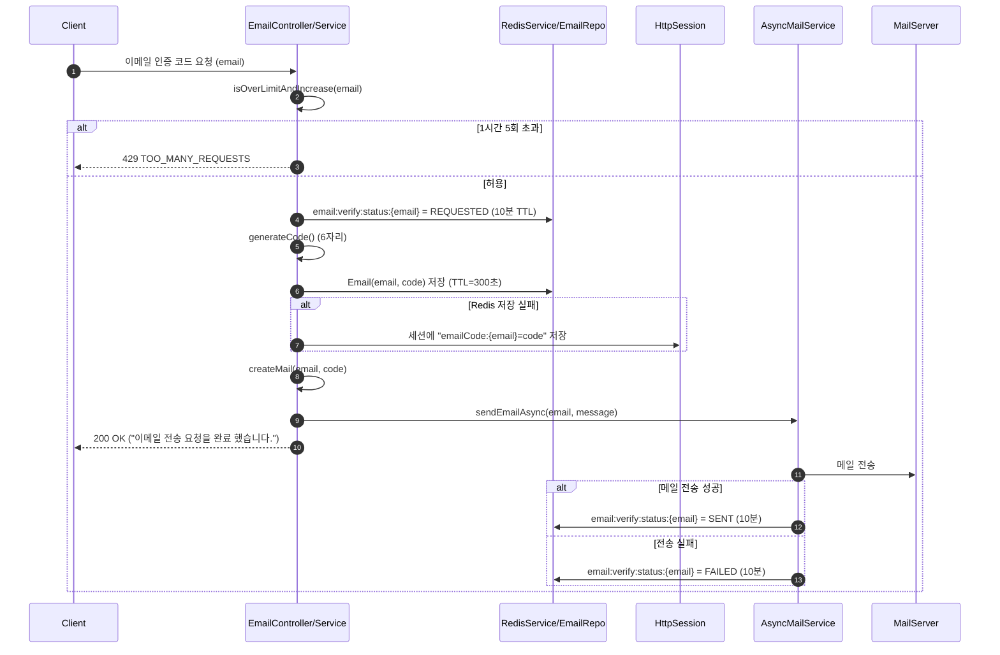

문서명: `auth-email-verification.md`

---

# 이메일 인증 코드 시스템

> MindMate에서 회원가입 시 사용하는 **이메일 인증 코드(6자리 숫자)** 시스템 문서이다.
> 이 문서는 인증 코드 생성·저장·전송·검증·요청 제한·상태 조회까지의 흐름을 정리한다.
> 메일 발송 실패, Redis 장애 등 예외 상황에서의 Fallback 전략도 함께 다룬다.

---

## 1. 개요

이메일 인증 시스템은 다음과 같은 요구사항을 기반으로 설계되었다.

-   6자리 숫자 코드 기반 이메일 인증
-   **1시간 안에 최대 5회**까지만 코드 요청 허용
-   인증 코드는 **Redis 기반 `Email` 엔티티(@RedisHash, TTL=300초)** 에 저장
-   Redis 장애 시 **HttpSession으로 Fallback**
-   실제 메일 전송은 `@Async` 비동기로 처리
-   발송 상태값 저장 (REQUESTED, SENT, FAILED)

이 구조를 통해, 과도한 인증 요청을 제어하면서도
Redis 장애 시에도 최소 기능은 유지할 수 있도록 설계했다.

> ※ 이메일 발송 상태(`REQUESTED`, `SENT`, `FAILED`)는 서버 단에서 기록되며, 현재 UI에서는 직접 조회하지 않지만 향후 전송 상태 표시용으로 활용 가능하다.

---

## 2. 구성 요소

| 컴포넌트           | 역할                                                     |
| ------------------ | -------------------------------------------------------- |
| `EmailService`     | 코드 생성·저장, 요청 제한, 상태 조회, 비즈니스 로직 핵심 |
| `AsyncMailService` | 메일 전송 비동기 처리, 전송 결과에 따른 상태값 갱신      |
| `RedisService`     | 단순 String 기반 Redis 연산(get/set/delete + TTL) 래핑   |
| `EmailRepository`  | 인증 코드 저장용 Redis 엔티티(`Email`, TTL=300초)        |
| `JavaMailSender`   | 실제 메일 전송(Spring Mail)                              |
| `HttpSession`      | Redis 장애 시 코드·카운트 Fallback 저장소                |

주요 Prefix/Key:

-   요청 횟수: `email:verify:count:{email}`
-   상태 값: `email:verify:status:{email}` (REQUESTED / SENT / FAILED)
-   코드 저장:

    -   Redis: `Email` 엔티티 (key = email, value = code, TTL=300초)
    -   Session Fallback: `emailCode:{email}`

---

## 3. 인증 코드 요청 흐름

### 3.1 전체 흐름 요약

1. 클라이언트가 이메일로 인증 코드 요청
2. 1시간 요청 횟수(최대 5회) 초과 여부 검사
3. 6자리 숫자 코드 생성
4. Redis `Email` 엔티티에 코드 저장 (TTL 300초)

    - 실패 시 HttpSession에 저장

5. Redis에 상태값 `REQUESTED` 기록
6. `MimeMessage` 생성 후 비동기 메일 발송 요청
7. 응답: 200 OK (이메일 전송을 비동기로 요청함)

### 3.2 Sequence Diagram



---

## 4. 인증 코드 생성 및 저장

### 4.1 코드 생성

```java
private String generateCode() {
    // 100000 ~ 999999 범위에서 랜덤 6자리
    return Integer.toString((int) (Math.random() * 900000) + 100000);
}
```

-   6자리 숫자 코드
-   단순 난수 기반

### 4.2 코드 저장 로직

```java
public String createAndStoreCode(String email, HttpServletRequest request) {
    // 1시간 5회 제한 체크
    if (isOverLimitAndIncrease(email, request)) {
        throw new IllegalStateException("인증코드 요청 가능 횟수를 초과했습니다. 잠시 후 다시 시도해주세요.");
    }

    String code = generateCode();

    // Redis에 Email 엔티티 저장 (유효시간 300초)
    try {
        Email emailEntity = new Email(email, code);
        emailRepository.save(emailEntity); // @RedisHash(timeToLive=300)
    } catch (Exception e) {
        // Redis 장애 시 세션에 저장
        HttpSession session = request.getSession(true);
        session.setAttribute("emailCode:" + email, code);
    }

    return code;
}
```

정책:

-   기본 저장소: Redis 기반 `EmailRepository` (`@RedisHash(timeToLive=300)`)
-   예외 발생 시:

    -   HttpSession에 `"emailCode:{email}"` 형태로 코드 저장

---

## 5. 요청 횟수 제한 (1시간 5회)

### 5.1 Redis 기반 카운트

```java
private boolean isOverLimitAndIncrease(String email, HttpServletRequest request) {
    String key = EMAIL_COUNT_KEY_PREFIX + email;
    // 예: email:verify:count:tiger@abc.com

    try {
        String current = redisService.getData(key);
        int count = (current == null) ? 0 : Integer.parseInt(current);

        if (count >= MAX_REQUESTS_PER_HOUR) {
            return true;
        }

        int newCount = count + 1;
        long oneHourSeconds = 60 * 60;
        redisService.setDataExpire(key, String.valueOf(newCount), oneHourSeconds);
        return false;

    } catch (Exception e) {
        // Redis 장애 시 세션으로 대체
        HttpSession session = request.getSession(true);
        String sessionKey = "emailCodeCount:" + email;
        Object value = session.getAttribute(sessionKey);

        int count = 0;
        if (value instanceof Integer) {
            count = (Integer) value;
        }

        if (count >= MAX_REQUESTS_PER_HOUR) {
            return true;
        }

        session.setAttribute(sessionKey, count + 1);
        return false;
    }
}
```

요약:

-   `MAX_REQUESTS_PER_HOUR = 5`
-   카운트 저장:

    -   Redis: `email:verify:count:{email}`, TTL = 1시간
    -   Redis 실패 시: Session `"emailCodeCount:{email}"` 사용

-   카운트가 5 이상이면 `true` 반환 → 호출부에서 `IllegalStateException` 발생

---

## 6. 이메일 상태 관리(REQUESTED / SENT / FAILED)

> ※ 상태 값은 현재 클라이언트에서 사용되지 않으며, 향후 "전송 중/완료/실패" UI에 사용 가능하다.

### 6.1 상태 키 및 TTL

```java
private static final String EMAIL_STATUS_KEY_PREFIX = "email:verify:status:";
private static final long EMAIL_STATUS_TTL_SECONDS = 60 * 10; // 10분
```

-   상태 값:

    -   `REQUESTED` : 코드 발송 요청 직후
    -   `SENT` : 비동기 메일 전송 성공
    -   `FAILED` : 비동기 메일 전송 실패
    -   `NONE` : 상태 정보 없음(요청 전 또는 TTL 만료 이후)

### 6.2 상태 조회 API

```java
public ResponseEntity<?> getEmailStatus(String email) {
    String statusKey = EMAIL_STATUS_KEY_PREFIX + email;

    try {
        String status = redisService.getData(statusKey);

        if (status == null) {
            return ResponseEntity.ok("NONE");
        }
        return ResponseEntity.ok(status); // REQUESTED / SENT / FAILED

    } catch (Exception e) {
        return ResponseEntity.status(HttpStatus.SERVICE_UNAVAILABLE)
                .body("이메일 상태를 조회할 수 없습니다.");
    }
}
```

특징:

-   상태 정보가 없으면 `"NONE"` 반환
-   Redis 장애 시 503(Service Unavailable) 응답

### 6.3 비동기 메일 전송과 상태 값 갱신

```java
@Async
public void sendEmailAsync(String email, MimeMessage message) {
    String statusKey = EMAIL_STATUS_KEY_PREFIX + email;

    try {
        javaMailSender.send(message);
        // 전송 성공 => SENT
        redisService.setDataExpire(statusKey, "SENT", EMAIL_STATUS_TTL_SECONDS);
    } catch (Exception e) {
        // 전송 실패 => FAILED
        redisService.setDataExpire(statusKey, "FAILED", EMAIL_STATUS_TTL_SECONDS);
    }
}
```

`EmailService.sendMailWithCode()`에서는 요청 직후 `"REQUESTED"`로 설정하고,
실제 메일 전송 성공/실패에 따라 `AsyncMailService`가 `"SENT"` 또는 `"FAILED"`로 상태를 변경한다.

---

## 7. 코드 검증 방식(소프트 체크 / 하드 체크)

### 7.1 코드 조회

```java
private String findCode(String email, HttpServletRequest request) {
    try {
        Optional<Email> _email = emailRepository.findById(email);
        if (_email.isPresent()) {
            return _email.get().getCode();
        }
    } catch (Exception e) {
        // Redis 장애 => 세션에서 처리
    }

    HttpSession session = request.getSession(false);
    if (session == null) return null;

    Object sessionCode = session.getAttribute("emailCode:" + email);
    if (sessionCode == null) return null;

    return sessionCode.toString();
}
```

### 7.2 코드 삭제

```java
private void deleteCode(String email, HttpServletRequest request) {
    try {
        emailRepository.deleteById(email);
    } catch (Exception e) {
        // 에러 무시
    }

    HttpSession session = request.getSession(false);
    if (session != null) {
        session.removeAttribute("emailCode:" + email);
    }
}
```

### 7.3 소프트 체크 (코드 유지)

```java
public boolean checkEmailCodeOnly(String email, String code, HttpServletRequest request) {
    String savedCode = findCode(email, request);
    if (savedCode == null) return false;
    return savedCode.equals(code);
}
```

-   용도:

    -   화면에서 “미리 코드가 맞는지 확인”할 때
    -   코드가 맞더라도 삭제하지 않는다.

### 7.4 하드 체크 (코드 삭제)

```java
public boolean isEmailCode(String email, String code, HttpServletRequest request) {
    if (!checkEmailCodeOnly(email, code, request)) {
        return false;
    }
    deleteCode(email, request);
    return true;
}
```

-   용도:

    -   실제 회원가입 완료 시점 등,
        코드가 한 번 사용되면 다시 사용할 수 없어야 할 때

-   코드가 유효하면 삭제 후 `true` 반환

---

## 8. 메일 본문 템플릿

`createMail(email, code)`에서 HTML 템플릿을 사용하여 인증 코드 메일을 생성한다.

특징:

-   제목: `"MindMate 이메일 인증 코드 안내"`
-   본문: MindMate 브랜드 스타일 적용된 HTML
-   코드가 강조된 박스에 삽입되어 사용자에게 안내

핵심 구조는 다음과 같다.

```java
String body = """
    ... (중략) ...
        <td align="center" ...>
            %s
        </td>
    ... (중략) ...
    """.formatted(code);
```

-   `%s` 위치에 6자리 코드가 삽입된다.
-   컨텐츠 타입은 `"text/html; charset=UTF-8"`로 설정한다.

---

## 9. 장애 및 Fallback 전략

| 상황                   | 처리 방식                                        |
| ---------------------- | ------------------------------------------------ |
| Redis 장애 (코드 저장) | HttpSession에 코드 저장                          |
| Redis 장애 (카운트)    | HttpSession에 `"emailCodeCount:{email}"` 사용    |
| Redis 장애 (상태 조회) | 503 응답 + `"이메일 상태를 조회할 수 없습니다."` |
| 메일 발송 실패         | 상태 FAILED, UI에는 알림 없음                    |

-   Redis 사용이 불가능한 경우에도,
    최소한의 기능(코드 생성·검증, 요청 제한)은 Session으로 유지한다.

---

## 10. 정리

이메일 인증 코드 시스템의 특징:

-   6자리 숫자 코드 기반 간단한 인증 구조
-   Redis + Session Fallback을 이용한 **탄력적인 저장/제한 구조**
-   1시간 5회 제한으로 과도한 인증 요청 방지
-   비동기 메일 발송과 상태 키(`REQUESTED`, `SENT`, `FAILED`)를 통한
    프론트엔드 UX 개선(“전송 중/성공/실패” 표시 가능)
-   소프트 체크 / 하드 체크로,
    “검증만” 필요한 경우와 “실제 사용 후 소모”해야 하는 경우를 분리

이 문서는 실제 구현 코드에 맞춰 작성되었으며,
회원가입 문서에서는 이 인증 시스템을 **“이메일 검증 선행 조건”**으로 간단히 참조하면 된다.
