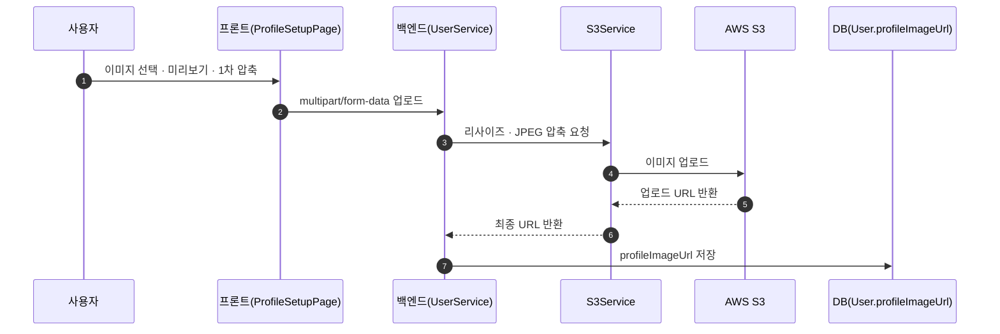
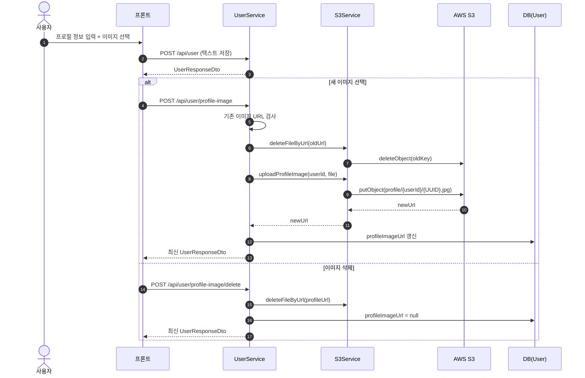
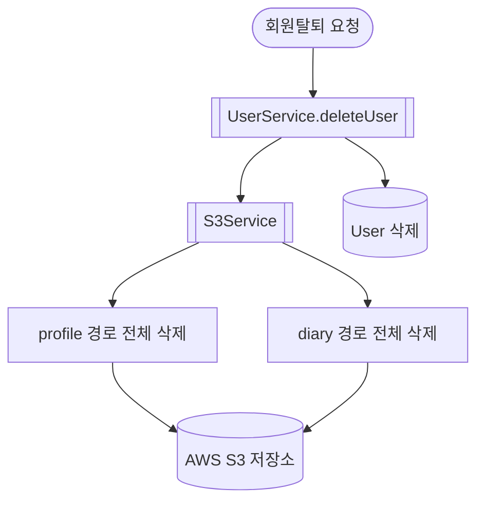

# 프로필 이미지 업로드 · 교체 · 삭제 (User + S3)

> MindMate에서 구현한 **프로필 이미지 처리 시스템** 전체 구조와 설계 배경을 정리한 문서이다.
> 이 문서는 프로필 이미지가 UX·네트워크·서버 품질에 모두 영향을 미치기 때문에
> **프론트(1차 압축) → 백엔드(최종 품질) → S3(저장) → DB(URL 관리)**로 이어지는 전체 파이프라인을 중심으로 설명한다.
> JWT 인증 및 Redis 기반 토큰 전략은 `auth-jwt.md`, Axios 재발급 구조는 `auth-axios.md` 문서를 전제로 한다.

---

## 1. 설계 의도 (Design Background)

프로필 이미지는 단순 파일 업로드가 아니라 **전체 사용자 경험 품질에 직결되는 핵심 기능**이다.
이를 위해 다음 원칙을 중심으로 설계했다.

### (1) 텍스트 정보와 이미지 정보를 API 단위로 분리

-   텍스트 정보: `/api/user`
-   이미지 전용: `/api/user/profile-image`, `/api/user/profile-image/delete`

API의 역할을 명확히 분리하여 유지보수성·확장성을 확보했다.

---

### (2) 원본 이미지는 S3에 저장, DB에는 URL만 저장

-   DB에는 문자열만 저장 → 안정적이고 대용량에 적합
-   백업, 복구, 마이그레이션 부담 구성
-   일기 이미지와 동일한 구조로 확장 가능

---

### (3) 최종 이미지 품질 관리는 백엔드 담당

프론트는 미리보기·1차 압축만 수행하고
최종 해상도(512px)·JPEG 압축(0.8)은 **백엔드에서 일괄 적용**한다.

→ 기기/브라우저 환경에 상관없이 품질 일정
→ 저장 용량·대역폭 절감

---

### (4) prefix 기반 S3 key 구조로 회원탈퇴 시 전체 삭제 용이

-   프로필: `profile/{userId}/...`
-   일기: `diary/{userId}/...`

사용자 ID 기반 prefix 설계를 통해
회원탈퇴 시 전체 데이터 정리를 단 몇 줄로 처리 가능하다.

---

### (5) UX 안정성을 위한 프론트 1차 압축 · 상태 분기

프론트는

-   파일 타입/용량 검증
-   이미지 1차 압축 (browser-image-compression)
-   “업로드/삭제/유지” 상태 기반 분기
-   Blob 미리보기 적용

을 담당하여 빠른 UI 응답성과 사용자 혼란 방지를 담당한다.

---

## 2. 전체 구조 개요 (Pipeline Overview)



---

## 3. 전체 플로우 (이미지 업로드/교체/삭제)



---

## 4. 저장 구조 및 도메인 설계

### 4.1 User 엔티티 — DB에는 URL만 저장

```java
@Column(name = "profile_image_url")
private String profileImageUrl;
```

> DB는 순수하게 “URL 주소 문자열”만 보관한다.

---

### 4.2 S3 저장 규칙

-   **프로필 이미지**
    `profile/{userId}/{UUID}.jpg`
-   **일기 이미지**
    `diary/{userId}/{UUID}.jpg`

**설계 이점**

-   사용자 단위 삭제 용이(prefix)
-   도메인 구조 일관성 → S3Service 재사용 용이
-   Public URL 그대로 `` 사용 가능

---

## 5. 프론트 처리 흐름 (UX 중심)

### 5.1 이미지 선택 시 처리

-   MIME 검증(`image/*`)
-   10MB 제한
-   `browser-image-compression`

    -   최대 해상도 1920px
    -   약 0.7MB 정도로 압축

-   Blob URL로 즉시 미리보기

---

### 5.2 업로드/삭제/유지 분기

| 사용자 행동      | 프론트 처리 방식            | 호출 API                         |
| ---------------- | --------------------------- | -------------------------------- |
| 새 이미지 선택   | 미리보기 표시 → 업로드 준비 | `/api/user/profile-image`        |
| 기존 이미지 삭제 | 미리보기 제거 → 삭제 요청   | `/api/user/profile-image/delete` |
| 이미지 변경 없음 | 텍스트 정보만 저장          | `/api/user`                      |

---

### 5.3 Avatar 컴포넌트 정책

-   항상 **백엔드에서 저장된 S3 URL** 사용
-   이미지 없을 때만 닉네임 첫 글자 fallback
-   Blob 미리보기는 *업로드 직전 화면*에서만 사용

---

## 6. 백엔드 API 설계

### 6.1 텍스트 정보 저장

`POST /api/user`
`PUT /api/user`

-   닉네임 중복 체크
-   생년월일/MBTI/닉네임 저장
-   이미지와는 완전히 독립된 API

---

### 6.2 프로필 이미지 업로드

`POST /api/user/profile-image`
요청: `multipart/form-data`

처리 과정:

1. JWT에서 userId 추출
2. 기존 이미지 있으면 S3 삭제
3. 파일 검증(확장자/비어 있음)
4. 서버 리사이즈(512px)
5. JPEG(0.8) 압축
6. putObject() 업로드
7. DB에 URL 저장
8. 최신 UserResponseDto 반환

---

### 6.3 프로필 이미지 삭제

`POST /api/user/profile-image/delete`

과정:

1. URL 없으면 400
2. 파일 삭제
3. URL null 처리
4. UserResponseDto 반환

---

## 7. S3Service 역할

### 7.1 업로드

-   BufferedImage 로드
-   최대 512px 리사이즈
-   Thumbnailator(JPEG 압축)
-   `putObject()` 호출
-   URL 반환

---

### 7.2 단일 삭제

-   URL → key 파싱
-   `deleteObject(bucket, key)`

---

### 7.3 회원탈퇴 전체 삭제

-   `profile/{userId}/**`
-   `diary/{userId}/**`
    → prefix 기반 일괄 삭제

---

## 8. 회원탈퇴 이미지 정리 흐름



> S3 정리 후 최종적으로 UserRepository.delete() 수행.

---

## 9. 오류 처리 규칙

### 공통

-   `401` — 토큰 없음 / 무효
-   `404` — 사용자 없음

### 업로드/삭제

-   `400`

    -   파일 없음
    -   이미지 아님
    -   삭제 요청 시 URL 없음

-   `500`

    -   S3 업로드/삭제 에러

---

## 10. 요약

-   프로필 이미지 기능은 **텍스트 정보와 이미지 정보 분리**를 기반으로 설계되었다.
-   프론트는 사용자 경험 중심(압축·미리보기·상태 분기),
    백엔드는 품질 통일(리사이즈·압축)과 전체 S3 정리 로직을 담당한다.
-   prefix 기반 저장 구조로 회원탈퇴 시 전체 삭제가 간결하다.
-   Avatar와 UI는 항상 **최종 S3 URL**만 참조해 일관성이 유지된다.
