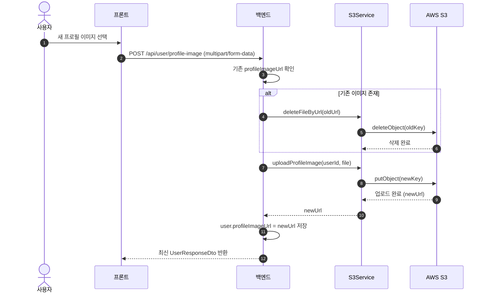

# 프로필 이미지 업로드 · 수정 · 삭제 (User + S3)

> MindMate에서 **프로필 이미지**를 업로드/교체/삭제하는 전체 흐름을 정리한다.  
> 프로필 기본 정보(닉네임/생일/MBTI)는 `/api/user`에서 처리하고,  
> 이미지는 별도 엔드포인트(`/api/user/profile-image`, `/api/user/profile-image/delete`)로 관리한다.

---

## 1. 전체 구조 개요

### 1.1 기능 분류

이미지 관련 기능은 크게 세 가지로 나뉜다.

1. **프로필 기본 정보 저장**

    - API: `POST /api/user`
    - 내용: 닉네임, 생년월일, MBTI 저장 및 검증
    - 담당: `UserService.setProfile(...)`

2. **프로필 이미지 업로드 / 교체**

    - API: `POST /api/user/profile-image`  
      (요청 형식: `multipart/form-data`)
    - 내용:
        - 기존 이미지가 있으면 S3에서 먼저 삭제
        - 새 파일 업로드 후, URL을 `User.profileImageUrl`에 저장
    - 담당: `UserService.uploadProfileImage(...)`
        - `S3Service.uploadProfileImage(...)`

3. **프로필 이미지 삭제**
    - API: `POST /api/user/profile-image/delete`
    - 내용:
        - 현재 프로필 이미지가 존재하면 S3에서 삭제
        - DB에서 `User.profileImageUrl`을 `null`로 초기화
    - 담당: `UserService.deleteProfileImage(...)`
        - `S3Service.deleteFileByUrl(...)`

> 일기 이미지 업로드도 같은 `S3Service`를 사용하지만,  
> 이 문서는 **프로필 이미지 흐름만** 다룬다.

---

## 2. 저장 구조 설계

### 2.1 User 엔티티 – 이미지 URL만 보관

-   실제 파일은 **S3 버킷**에 저장한다.
-   DB에는 **이미지 파일 자체가 아니라**,  
    S3 접근을 위한 **Public URL**만 `User.profileImageUrl` 필드에 저장한다.
-   회원탈퇴 시:
    -   `profileImageUrl`을 `null`로 초기화
    -   S3에 저장된 파일은 `deleteAllUserImages(userId)`로 일괄 삭제

### 2.2 S3 버킷 경로 구조

-   프로필 이미지: `profile/{userId}/{UUID}.jpg`
-   일기 이미지: `diary/{userId}/{UUID}.jpg`

설계 의도:

-   유저 단위로 이미지 정리(탈퇴, 초기화 등)가 쉽다.
-   동일한 `S3Service`를 기준으로 프로필·일기 이미지를 공용 처리할 수 있다.

---

## 3. 이미지 처리 분기

-   새 이미지가 선택된 경우 → 업로드 API 호출
-   기존 이미지를 제거한 경우 → 삭제 API 호출
-   둘 다 아닐 경우 → 이미지 변경 없음

---

## 4. 프로필 이미지 업로드 시퀀스 다이어그램



---

## 5. 백엔드 API 설계 (요청/응답 관점)

### 5.1 프로필 기본 정보 저장 – `POST /api/user`

**인증**

-   `Authorization: Bearer {accessToken}`

**요청 바디 예시**

```json
{
    "nickname": "모난초",
    "birth_date": "1995-05-12",
    "mbti": "INFP"
}
```

**처리 흐름**

1. 토큰에서 `userId` 추출 후 유저 조회
2. 닉네임이 변경된 경우, 중복 여부 검증
3. 닉네임 / 생년월일 / MBTI 값을 업데이트
4. 갱신된 사용자 정보를 `UserResponseDto`로 반환

**응답 예시**

```json
{
    "id": 1,
    "nickname": "모난초",
    "birth_date": "1995-05-12",
    "mbti": "INFP",
    "authType": "LOCAL",
    "role": "USER",
    "profile_image_url": "https://{bucket}.s3.amazonaws.com/profile/1/xxxx.jpg",
    "email": "example@mindmate.com"
}
```

**비고**

-   텍스트 정보 저장용 API이며,
    **프로필 이미지 업로드/삭제는 별도 엔드포인트**에서 처리된다.

### 5.2 프로필 이미지 업로드/교체 – `POST /api/user/profile-image`

**인증**

-   `Authorization: Bearer {accessToken}`

**요청**

-   `multipart/form-data`
-   필드: `file` (이미지 파일)

**처리 흐름**

1. 토큰에서 `userId` 추출 후 유저 조회
2. 기존 `profileImageUrl`이 있으면 S3에서 삭제
3. 새 이미지 업로드 (`profile/{userId}/{UUID}.jpg`)
4. 업로드된 URL을 `user.profileImageUrl`에 저장
5. 최신 `UserResponseDto` 반환

**응답 예시**

```json
{
    "id": 1,
    "nickname": "호랑이",
    "birth_date": "1995-05-12",
    "mbti": "INFP",
    "authType": "LOCAL",
    "role": "USER",
    "profile_image_url": "https://{bucket}.s3.amazonaws.com/profile/1/xxxx.jpg",
    "email": "example@mindmate.com"
}
```

### 5.3 프로필 이미지 삭제 – `POST /api/user/profile-image/delete`

**인증**

-   `Authorization: Bearer {accessToken}`

**요청**

-   바디 없음

**처리 흐름**

1. 토큰에서 `userId` 추출 후 유저 조회
2. 등록된 `profileImageUrl`이 없으면 `400 BAD_REQUEST`
3. S3에서 해당 이미지 삭제
4. DB의 `profileImageUrl`을 `null`로 초기화
5. 최신 `UserResponseDto` 반환

---

## 6. S3Service 역할 정리

### 6.1 프로필 이미지 업로드

**입력**

-   `userId`
-   `MultipartFile file`

**기능**

1. 파일 존재 여부 및 `image/*` 타입 검증
2. 이미지를 디코딩하여 크기 확인
3. 최대 한 변 512px 기준으로 리사이즈
4. JPEG 포맷 + 품질 0.8로 재인코딩
5. S3에 `profile/{userId}/{UUID}.jpg` 경로로 저장
6. Public URL 반환

**결과**

-   반환된 URL은 그대로 `User.profileImageUrl` 및 프론트의 ``에 사용 가능하다.

### 6.2 URL 기반 단일 파일 삭제

**입력**

-   전체 S3 파일 URL (`https://...amazonaws.com/{key}`)

**기능**

1. URL이 비어 있거나 공백인 경우 바로 종료
2. `.amazonaws.com/` 기준으로 key 부분 추출
3. 추출 실패(형식이 다름) 시 조용히 무시
4. `amazonS3.deleteObject(bucket, key)` 호출

### 6.3 유저 단위 일괄 삭제 (회원탈퇴용)

**입력**

-   `userId`

**기능**

1. `profile/{userId}/` 프리픽스를 가지는 객체 전체 삭제
2. `diary/{userId}/` 프리픽스를 가지는 객체 전체 삭제
3. 내부적으로 `listObjectsV2 + deleteObjects` 반복 호출

**사용처**

-   `UserService.deleteUser(...)`에서 회원탈퇴 시 호출된다.
-   S3 삭제가 실패하더라도 **회원탈퇴 자체는 계속 진행**하는 정책을 사용한다.

---

## 7. 오류 처리 정책

-   401 UNAUTHORIZED: 토큰 누락/만료
-   400 BAD_REQUEST: 파일 없음, 이미지 형식 아님, 삭제 대상 이미지 없음
-   404 NOT_FOUND: 유저 없음
-   409 CONFLICT: 프로필 정보 충돌
-   500 INTERNAL_SERVER_ERROR: S3 업로드/삭제 오류

---

## 8. 요약

-   **저장 구조**

    -   실제 이미지는 S3에 저장
    -   DB에는 `profileImageUrl`만 저장하는 **URL 기반 구조**

-   **프론트 흐름**

    -   프로필 정보(`POST /api/user`) 저장 후,
    -   이미지 상태(`imageFile`, `imagePreview`, `originalHasImage`)에 따라

        -   업로드 (`POST /api/user/profile-image`)
        -   삭제 (`POST /api/user/profile-image/delete`)
        -   그대로 유지 중 하나를 선택

-   **백엔드 정책**

    -   업로드/삭제 시 항상

        1. S3 처리 (기존 파일 정리 포함)
        2. DB의 `profileImageUrl` 업데이트
        3. 최신 상태의 `UserResponseDto` 반환

    -   회원탈퇴 시에는 `deleteAllUserImages(userId)`로
        프로필/다이어리 이미지를 모두 정리한다.
