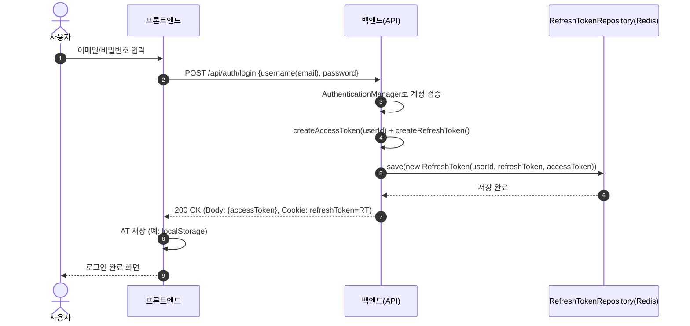
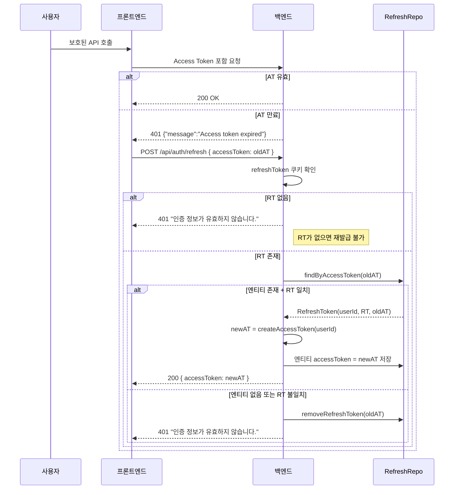

# JWT 기반 인증 시스템 (Access Token · Refresh Token · Redis)

> MindMate 백엔드에서 구현한 **JWT 기반 인증(Access/Refresh Token + Redis)** 구조 문서이다.
> 로컬 로그인·소셜 로그인 모두 동일한 JWT/Redis 전략을 사용한다.
> Refresh Token 저장, 재발급, 필터 구조, 예외 처리까지 **백엔드 기준**으로 정리한다.
> 프론트엔드 Axios 인터셉터 + 리프레시 큐 구현은 별도 문서에서 다룬다.

---

# 1. 개요

MindMate의 인증 구조는 **세션 기반이 아닌 JWT 무상태(stateless) 인증**을 사용한다.

-   **Access Token (AT)**

    -   짧은 주기의 인증용 토큰
    -   JWT `subject = userId` 를 사용

-   **Refresh Token (RT)**

    -   재발급용 토큰
    -   **Spring Data Redis(@RedisHash)** 에 `RefreshToken` 엔티티로 저장

-   **프론트엔드**

    -   AT를 `Authorization: Bearer <token>` 헤더에 담아 보호된 API 호출

-   **백엔드**

    -   Spring Security + `JwtAuthenticationFilter` 로 AT 검증
    -   RT는 `/api/auth/refresh` 에서만 사용

**실제 수명 설정 (코드 기준)**

-   Access Token 만료 시간: **30분**

    ```java
    private static final long ACCESS_TOKEN_EXPIRE_TIME = 1000 * 60 * 30;
    ```

-   Refresh Token 만료 시간:

    -   JWT 내부 exp: **7일**

        ```java
        private static final long REFRESH_TOKEN_EXPIRE_TIME = 1000 * 60 * 60 * 24 * 7;
        ```

    -   Redis TTL: **3일**

        ```java
        @RedisHash(value = "refreshToken", timeToLive = 60 * 60 * 24 * 3)
        ```

> 결과적으로 Refresh Token은
> **JWT 자체는 7일**, Redis 저장소에서는 3일 유지되며,
> **실제 사용 가능 수명은 “최대 3일”**이다.
> (Redis 엔티티가 삭제되면 재발급이 불가능하다.)

**설계 목표**

-   명확한 토큰 수명 관리
-   일관된 에러 응답 포맷
-   Redis 기반 `RefreshToken` 엔티티로 AT–RT 매핑 관리
-   로그인 방식(로컬·소셜)에 상관없는 공통 인증 구조
-   재발급 실패 시 서버/클라이언트 양쪽에서 세션을 명확히 정리

---

# 2. 로그인 · 토큰 발급 흐름

> 아래 내용은 **로컬 로그인(/api/auth/login)** 기준이며,
> 소셜 로그인도 마지막 단계에서 동일한 JWT 발급 흐름을 사용한다.

## 2.1 전체 흐름 요약

1. 사용자가 **이메일/비밀번호**로 로그인 요청
2. Spring Security `AuthenticationManager` 로 계정 검증
3. 검증 성공 시:

    - `createAccessToken(userId)` 로 AT 생성
    - `createRefreshToken()` 로 RT 생성

4. `RefreshToken(userId, refreshToken, accessToken)` 엔티티를 **Redis에 저장**
5. 응답:

    - **Body**: `{ "accessToken": "<AT>" }`
    - **Cookie(HttpOnly)**: `refreshToken=<RT>`

## 2.2 Sequence Diagram (로그인 → RT 저장 → 로그인 완료)



---

# 3. 토큰 만료 · 재발급 흐름 (백엔드 관점)

## 3.1 재발급이 일어나는 조건

프론트는 보호된 API 호출 시 AT를 실어 보내고,
백엔드는 `JwtAuthenticationFilter` 에서 AT를 검증한다.

-   AT가 만료된 경우:

    -   필터에서 `401` + `{"message": "Access token expired"}` 응답
    -   프론트는 이 응답을 보고 `/api/auth/refresh` 호출

-   AT가 위조/형식 오류인 경우:

    -   `401` + `{"message": "Invalid token"}` 응답
    -   프론트는 재발급 없이 바로 로그아웃 처리

**재발급 성공 조건(AccountService 기준)**

1. **쿠키에 `refreshToken` 값이 존재**해야 한다.

2. 요청 Body의 `oldAccessToken` 으로 Redis에서 `RefreshToken` 엔티티를 조회할 수 있어야 한다.

    ```java
    Optional<RefreshToken> foundTokenInfo = jwtUtil.checkRefreshToken(oldAccessToken);
    ```

3. Redis 엔티티에 저장된 `refreshToken` 값과 **쿠키의 RT 문자열이 일치**해야 한다.

4. RT 엔티티가 Redis TTL(3일) 내에 살아 있어야 한다.
   (TTL 초과 시 엔티티 삭제 → 재발급 불가)

## 3.2 Sequence Diagram (AT 만료 → 재발급 → 성공/실패)



> 재발급에 실패한 경우, 프론트는
> 로컬 AT 삭제 + 로그인 페이지로 이동하는 방식으로 세션을 정리한다.
> (구체적인 Axios 구현은 Axios 문서에서 설명)

---

# 4. 서버 구성 요소

## 4.1 핵심 컴포넌트 요약

| 컴포넌트                    | 역할                                                                          |
| --------------------------- | ----------------------------------------------------------------------------- |
| **AuthController**          | `/signup`, `/login`, `/refresh`, `/logout`, `/delete` 엔드포인트 제공         |
| **AccountService**          | 로그인, 회원가입, 토큰 재발급, 로그아웃, 계정 삭제 비즈니스 로직              |
| **JwtUtil**                 | JWT 생성·검증, 헤더에서 토큰 추출, `userId(subject)` 추출                     |
| **JwtAuthenticationFilter** | 요청 헤더에서 AT 추출 → 검증 → `SecurityContext` 에 인증 정보 저장            |
| **RefreshTokenRepository**  | `RefreshToken` 엔티티(레디스) 저장 및 조회                                    |
| **RefreshTokenService**     | `saveTokenInfo`, `removeRefreshToken` 등 RT 저장/삭제 유틸                    |
| **UserRepository**          | 사용자 엔티티 조회                                                            |
| **SocialAuthService**       | 소셜 로그인/탈퇴 시 JWT 발급 및 User 연동, JwtUtil/RefreshTokenService 재사용 |

---

# 5. 토큰 전략

## 5.1 Access Token / Refresh Token 역할 분리

| 종류              | 역할      | 저장 위치                                        | 수명(코드 기준)                                         |
| ----------------- | --------- | ------------------------------------------------ | ------------------------------------------------------- |
| **Access Token**  | 인증/인가 | 브라우저 스토리지 또는 메모리 (예: localStorage) | 30분 (JWT Exp)                                          |
| **Refresh Token** | 재발급용  | HttpOnly Cookie + Redis(`RefreshToken` 엔티티)   | JWT Exp: 7일, Redis TTL: 3일 → 실제 사용 가능: 최대 3일 |

-   Access Token은 JWT `subject`에 **userId만** 저장한다.

    ```java
    .setSubject(String.valueOf(profileId))
    ```

-   Refresh Token은 **의미 있는 클레임 없이** 서명된 난수 토큰으로 사용한다.

    ```java
    Claims claims = Jwts.claims();
    ```

-   RT와 관련된 정보(userId, accessToken 매핑)는
    **Redis `RefreshToken` 엔티티**에 저장한다.

## 5.2 RefreshToken 저장 구조

### 엔티티

```java
@RedisHash(value = "refreshToken", timeToLive = 60 * 60 * 24 * 3) // 3일
public class RefreshToken {
    @Id
    private Long userId;

    private String refreshToken;

    @Indexed
    private String accessToken;

    public RefreshToken(Long userId, String refreshToken, String accessToken) {
        this.userId = userId;
        this.refreshToken = refreshToken;
        this.accessToken = accessToken;
    }
}
```

### 레포지토리

```java
public interface RefreshTokenRepository extends CrudRepository<RefreshToken, Long> {
    Optional<RefreshToken> findByAccessToken(String accessToken);
}
```

### 조회/검증 유틸

```java
public Optional<RefreshToken> checkRefreshToken(String accessToken) {
    if (!StringUtils.hasText(accessToken)) {
        return Optional.empty();
    }
    try {
        return refreshTokenRepository.findByAccessToken(accessToken);
    } catch (DataAccessException e) {
        return Optional.empty();
    }
}
```

### 정책 요약

-   하나의 Access Token에 대해 **하나의 Refresh Token** 쌍을 유지
-   재발급 시:

    -   Body의 `oldAccessToken` 으로 엔티티 조회
    -   엔티티의 `refreshToken` 과 쿠키의 RT 문자열 비교

-   엔티티가 없거나 RT가 불일치하면:

    -   `removeRefreshToken(oldAT)` 으로 엔티티 삭제
    -   RT 쿠키도 삭제 → 재발급 불가 상태로 명확히 정리

---

# 6. JWT 관련 주요 API

## 6.1 로그인 `POST /api/auth/login`

### 요청 예시

```json
{
    "username": "email@example.com",
    "password": "12345678"
}
```

### 처리 요약

```java
authenticationManager.authenticate(
    new UsernamePasswordAuthenticationToken(username, password)
);

Account account = accountRepository.findByUsername(username)
        .orElseThrow(() -> new RuntimeException("사용자를 찾을 수 없습니다."));

User user = account.getUser();
Long userId = user.getId();

String accessToken = jwtUtil.createAccessToken(userId);
String refreshToken = jwtUtil.createRefreshToken();

refreshTokenRepository.save(new RefreshToken(userId, refreshToken, accessToken));

ResponseCookie refreshCookie = ResponseCookie.from("refreshToken", refreshToken)
        .httpOnly(true)
        .secure(false)    // 배포 시 https + true로 변경 예정
        .sameSite("Lax")
        .path("/")
        .build();
response.addHeader("Set-Cookie", refreshCookie.toString());
```

### 응답 예시

```json
{ "accessToken": "<AT>" }
```

-   Body: Access Token
-   Cookie: Refresh Token (`HttpOnly`)

---

## 6.2 회원가입 `POST /api/auth/signup`

### 처리 흐름 요약

1. `AccountRequestDto` 유효성 검사 (`@Valid + BindingResult`)
2. 이메일/비밀번호 null·blank 검사
3. 이메일 중복 검사 (`userRepository.findByEmail`)
4. 이메일 인증 코드 검증 (`EmailService.isEmailCode`)

    - 실패 시: **422** + `"이메일 인증코드가 틀렸거나 만료되었습니다."`

5. `User` + `Account` 생성

    - 비밀번호는 `PasswordEncoder` 로 해시

6. 로그인과 동일하게 AT + RT 발급 및 Redis 저장

> 이메일 인증 상세 플로우는 별도 문서(`auth-email-verification.md`)에서 다룬다.

---

## 6.3 토큰 재발급 `POST /api/auth/refresh`

### 요청

-   Body 예시:

    ```json
    { "accessToken": "<oldAccessToken>" }
    ```

-   Cookie: `refreshToken=<RT>`

### 처리 코드 요약

```java
public ResponseEntity<?> generationToken(String oldAccessToken,
                                         String refreshToken,
                                         HttpServletResponse response) {

    if (refreshToken == null || refreshToken.isBlank()) {
        return new ResponseEntity<>("인증 정보가 유효하지 않습니다.", HttpStatus.UNAUTHORIZED);
    }

    Optional<RefreshToken> foundTokenInfo = jwtUtil.checkRefreshToken(oldAccessToken);

    if (foundTokenInfo.isEmpty()
        || !foundTokenInfo.get().getRefreshToken().equals(refreshToken)
        || refreshToken.isBlank()) {

        refreshTokenService.removeRefreshToken(oldAccessToken);

        ResponseCookie deleteCookie = ResponseCookie.from("refreshToken", "")
                .httpOnly(true)
                .secure(false)
                .sameSite("Lax")
                .path("/")
                .maxAge(0)
                .build();
        response.addHeader("Set-Cookie", deleteCookie.toString());

        return new ResponseEntity<>("인증 정보가 유효하지 않습니다.", HttpStatus.UNAUTHORIZED);
    }

    RefreshToken tokenEntity = foundTokenInfo.get();
    Long userId = tokenEntity.getUserId();

    String newAccessToken = jwtUtil.createAccessToken(userId);
    tokenEntity.setAccessToken(newAccessToken);
    refreshTokenRepository.save(tokenEntity);

    Map<String, String> result = new HashMap<>();
    result.put("accessToken", newAccessToken);
    return new ResponseEntity<>(result, HttpStatus.OK);
}
```

**특징**

-   RT는 **회전(rotate)하지 않고 유지**, Access Token만 교체
-   검증 실패 시:

    -   Redis에서 해당 AT 기반 엔티티 삭제
    -   RT 쿠키 삭제 (`maxAge(0)`)
    -   `401 "인증 정보가 유효하지 않습니다."` 반환

---

## 6.4 로그아웃 `POST /api/auth/logout`

```java
public ResponseEntity<?> logout(String header, HttpServletResponse response) {
    String accessToken = jwtUtil.findTokenByHeader(header);
    if (accessToken == null || accessToken.isBlank()) {
        return new ResponseEntity<>("토큰 정보가 없습니다.", HttpStatus.UNAUTHORIZED);
    }

    try {
        refreshTokenService.removeRefreshToken(accessToken);
    } catch (Exception e) {
        e.printStackTrace();
    }

    ResponseCookie deleteCookie = ResponseCookie.from("refreshToken", "")
            .httpOnly(true)
            .secure(false)
            .sameSite("Lax")
            .path("/")
            .maxAge(0)
            .build();
    response.addHeader("Set-Cookie", deleteCookie.toString());

    return new ResponseEntity<>("로그아웃 되었습니다.", HttpStatus.OK);
}
```

**결과**

-   해당 AT와 연결된 `RefreshToken` 엔티티 삭제
-   브라우저의 RT 쿠키 삭제
-   이후 `/api/auth/refresh` 시도도 항상 실패 → **완전 로그아웃 상태**

---

# 7. JWT 필터 구조 (`JwtAuthenticationFilter`)

## 7.1 필터 적용/제외 경로

```java
@Override
protected boolean shouldNotFilter(HttpServletRequest request) {
    String path = request.getRequestURI();

    return path.startsWith("/api/auth/login")
        || path.startsWith("/api/auth/signup")
        || path.startsWith("/api/auth/refresh")
        || path.startsWith("/oauth")       // 소셜 로그인 콜백 등
        || path.startsWith("/api/comments");
}
```

-   위 경로는 **JWT 없이 접근 허용 (permitAll)**

    -   로그인/회원가입/재발급 자체는 토큰 검증 대상이 아님
    -   `/oauth/**` 소셜 콜백도 JWT 없이 통과

-   그 외 대부분의 `/api/**` 는 JWT 필터를 거친 뒤 컨트롤러에 도달

## 7.2 필터 내부 처리

```java
@Override
protected void doFilterInternal(HttpServletRequest request,
                                HttpServletResponse response,
                                FilterChain filterChain)
        throws ServletException, IOException {

    String token = parseJwt(request);

    if (token != null && !token.isEmpty()) {
        try {
            Long profileId = jwtUtil.extractUserId(token);

            UsernamePasswordAuthenticationToken authenticationToken =
                    new UsernamePasswordAuthenticationToken(profileId, null, null);

            authenticationToken.setDetails(
                    new WebAuthenticationDetailsSource().buildDetails(request));

            SecurityContextHolder.getContext().setAuthentication(authenticationToken);

        } catch (ExpiredJwtException e) {
            System.out.println("JWT 토큰 만료: " + e.getMessage());
            SecurityContextHolder.clearContext();

            response.setStatus(HttpStatus.UNAUTHORIZED.value());
            response.setContentType("application/json;charset=UTF-8");
            response.getWriter().write("{\"message\":\"Access token expired\"}");
            response.getWriter().flush();
            return;

        } catch (JwtException | IllegalArgumentException e) {
            System.out.println("JWT 인증 실패: " + e.getMessage());
            SecurityContextHolder.clearContext();

            response.setStatus(HttpStatus.UNAUTHORIZED.value());
            response.setContentType("application/json;charset=UTF-8");
            response.getWriter().write("{\"message\":\"Invalid token\"}");
            response.getWriter().flush();
            return;
        }
    }

    filterChain.doFilter(request, response);
}
```

```java
private String parseJwt(HttpServletRequest request) {
    String headerAuth = request.getHeader(AUTHORIZATION_HEADER);
    if (StringUtils.hasText(headerAuth) && headerAuth.startsWith(BEARER_PREFIX)) {
        return headerAuth.substring(7);
    }
    return null;
}
```

**특징**

-   AT 유효:

    -   `jwtUtil.extractUserId(token)` 으로 userId 추출
    -   `Authentication` 생성 후 `SecurityContext` 에 저장

-   만료:

    -   `401` + `{"message":"Access token expired"}`

-   위조/형식 오류:

    -   `401` + `{"message":"Invalid token"}`

이 두 메시지를 기반으로, 프론트는

-   `"Access token expired"` → 재발급 시도
-   `"Invalid token"` → 재로그인 유도
    로 동작을 분리할 수 있다.

---

# 8. 예외 처리 정책 요약

## 8.1 Access Token 관련

| 상황           | 응답 코드 | 메시지(JSON)                         | 프론트 처리 방향          |
| -------------- | --------- | ------------------------------------ | ------------------------- |
| 만료           | 401       | `{"message":"Access token expired"}` | 재발급 시도               |
| 서명/형식 오류 | 401       | `{"message":"Invalid token"}`        | 로그아웃 후 재로그인 유도 |

## 8.2 Refresh Token / 재발급 관련

| 상황                          | 응답 코드 | 메시지(문자열)                   | 프론트 처리 방향        |
| ----------------------------- | --------- | -------------------------------- | ----------------------- |
| RT 쿠키 없음                  | 401       | `인증 정보가 유효하지 않습니다.` | 재로그인 요구           |
| `checkRefreshToken` 결과 없음 | 401       | `인증 정보가 유효하지 않습니다.` | 재로그인 요구           |
| RT 불일치                     | 401       | `인증 정보가 유효하지 않습니다.` | 재로그인 요구           |
| 재발급 실패 시 RT 엔티티 삭제 | -         | (서버 내부에서 삭제)             | 이후 재발급 불가        |
| 재발급 실패 시 RT 쿠키 삭제   | -         | `Set-Cookie: refreshToken=;...`  | 클라이언트 RT 자동 제거 |

---

# 9. 보안 · 운영 고려사항

-   `jwt.secret` 등 민감 정보는 **환경 변수/외부 설정 파일**로 분리
-   Refresh Token Cookie:

    -   `HttpOnly` 필수
    -   배포 환경에서는 HTTPS + `Secure` 옵션 활성화
    -   프론트/백 도메인 분리에 따라 `SameSite` 조정 필요 (`Lax` → `None`)

-   Redis:

    -   백엔드/Redis 컨테이너는 **내부 네트워크**로만 통신
    -   외부 포트는 최대한 닫아 직접 접속 차단

-   재발급 실패 시:

    -   서버: RT 엔티티 + 쿠키 삭제
    -   클라이언트: AT 삭제 + 로그인 페이지로 이동
        → “애매한 세션 상태”가 남지 않도록 양쪽에서 동시에 정리

---

# 10. 회고 · 개선 포인트

-   Access / Refresh Token을 분리하고,
    **Redis 기반 `RefreshToken` 엔티티로 AT–RT 쌍을 관리하는 구조**를 직접 설계했다.
-   백엔드 필터에서 만료/위조를 나눠
    `"Access token expired"` vs `"Invalid token"` 응답을 분리했고,
    프론트가 이 메시지를 기준으로

    -   재발급 시도 (만료)
    -   즉시 로그아웃 처리 (위조/형식 오류)
        로 다르게 동작하게 만들었다.

-   재발급 실패 시 RT 엔티티와 쿠키를 함께 삭제해,
    “중간에 꼬인 인증 상태”를 남기지 않고 **명확한 로그아웃 상태**로 정리했다.
-   회원 탈퇴/로그아웃 시에도 AccessToken에서 RT를 찾아 삭제해,
    “탈퇴 후에도 토큰이 남아 있는 상태”를 방지했다.
-   소셜 로그인에서도 이 JWT 전략을 그대로 재사용해,
    **로그인 방식이 달라도 인증 구조 자체는 일관**되도록 만들었다.

향후 개선 아이디어:

-   **기기별 Refresh Token 관리**

    -   디바이스별 로그인 기록·강제 로그아웃 기능

-   **비밀번호 변경/회원탈퇴 시 전체 RT 무효화**

    -   해당 유저의 모든 RT 일괄 삭제

-   **토큰 버전(version) 필드 도입**

    -   특정 시점 이전에 발급된 토큰을 전체 무효화

-   **역할/권한(role) 정보 포함**

    -   AT에 role을 넣어 인가 로직 강화
    -   프론트 UI에서도 role 기반 제어까지 확장 가능
