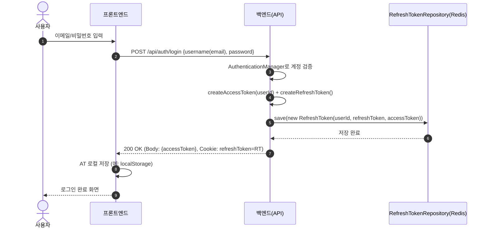
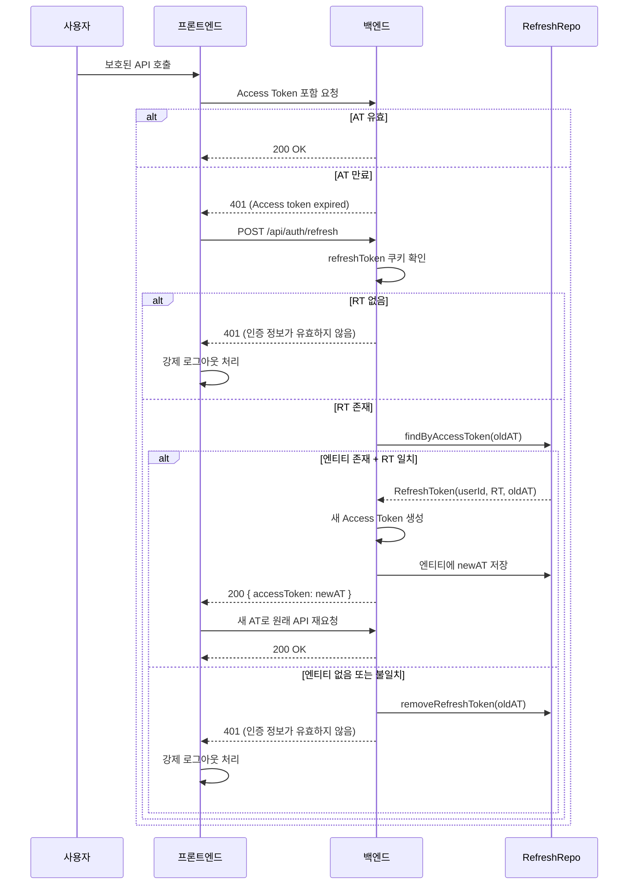

# JWT 기반 인증 시스템 (Access Token · Refresh Token · Redis)

> MindMate 백엔드에서 구현한 JWT 기반 인증(Access/Refresh Token + Redis) 구조 문서이다.
> 로컬 로그인·소셜 로그인 모두 동일한 JWT/Redis 전략을 사용한다.
> Refresh Token 저장, 재발급, 필터 구조, 예외 처리와 함께
> **프론트엔드 Axios 인터셉터 + 리프레시 큐 동작까지** 전체 흐름을 정리한다.
> 소셜 로그인, 이메일 인증, 프로필 기능은 별도 문서에서 다룬다.

---

# 1. 개요

MindMate의 인증 구조는 **세션 기반이 아닌 JWT 무상태(stateless) 인증**을 사용한다.

-   Access Token → 짧은 주기 인증용 (JWT `subject = userId`)
-   Refresh Token → **Spring Data Redis(@RedisHash)** 에 저장되는 재발급용 토큰
-   프론트엔드 → Axios 인터셉터로 401 감지 후 **리프레시 큐 기반 자동 재발급**
-   백엔드 → Spring Security + `JwtAuthenticationFilter` 기반 JWT 인증
-   모든 로그인 방식(로컬·소셜)은 동일한 JWT/Redis 구조를 통해 인증 상태를 유지한다.

**실제 수명 설정 (코드 기준)**

-   Access Token 만료 시간: **30분**

    ```java
    private static final long ACCESS_TOKEN_EXPIRE_TIME = 1000 * 60 * 30;
    ```

-   Refresh Token 만료 시간:

    -   JWT 내부 exp: **7일**

        ```java
        private static final long REFRESH_TOKEN_EXPIRE_TIME = 1000 * 60 * 60 * 24 * 7;
        ```

    -   Redis TTL: **3일**

        ```java
        @RedisHash(value = "refreshToken", timeToLive = 60 * 60 * 24 * 3)
        ```

> 결과적으로 Refresh Token은
> **JWT 자체는 7일**, Redis 저장소에서는 3일 유지되며,
> **실제 사용 가능 수명은 “최대 3일”**이다. (엔티티가 삭제되면 재발급 불가)

**핵심 목표**

-   명확한 토큰 수명 관리
-   일관된 에러 응답
-   RefreshToken 엔티티 기반의 재발급 구조
-   프론트/백엔드 간 역할이 분리된 인증 구조
-   프론트 다중 요청 시 **리프레시 큐로 동시성 깨짐(중복 재발급) 방지**

---

# 2. 로그인 · 토큰 발급 흐름

> 아래 요약은 ‘로컬 로그인’을 기준으로 설명하지만,
> 소셜 로그인도 마지막 단계에서 동일한 Access Token + Refresh Token 발급 흐름을 따른다.

## 2.1 전체 흐름 요약

1. 사용자가 이메일/비밀번호로 로그인 요청
2. 비밀번호 검증 성공
3. Access Token + Refresh Token 생성
4. `RefreshToken(userId, refreshToken, accessToken)` 엔티티를 Redis에 저장
5. 응답:

    - Access Token → Response Body
    - Refresh Token → HttpOnly Cookie

## 2.2 Sequence Diagram (로그인 → RT 저장 → 로그인 완료)



---

# 3. 토큰 만료 · 재발급 흐름

프론트엔드는 모든 보호된 API 요청에 **Access Token**을 포함한다.
토큰이 만료되면 백엔드에서 401을 내려보내고,
Axios 인터셉터가 이를 감지해 **자동으로 재발급 요청**을 보낸다.

## 3.1 재발급 조건 (AccountService 기준)

다음 조건을 모두 만족할 때만 재발급에 성공한다.

1. **refreshToken Cookie**가 존재해야 한다.

2. Body로 전달된 `oldAccessToken`으로 Redis에서 `RefreshToken` 엔티티를 찾을 수 있어야 한다.

    ```java
    Optional<RefreshToken> foundTokenInfo = jwtUtil.checkRefreshToken(oldAccessToken);
    ```

3. Redis 엔티티에 저장된 `refreshToken` 값과, 쿠키의 `refreshToken` 문자열이 일치해야 한다.

4. RefreshToken 엔티티가 **Redis TTL(3일)** 안에 살아 있어야 한다.
   → TTL이 지나 삭제되면 조회되지 않음 → 재발급 불가

## 3.2 Sequence Diagram (AT 만료 → 재발급 → 성공/실패)

Access Token이 만료되면 백엔드는 401과 "Access token expired" 메시지를 내려보낸다.
프론트 Axios 인터셉터는 이 메시지를 감지해 /api/auth/refresh로 재발급을 수행한다.



## 3.3 프론트엔드 Axios 인터셉터 & 리프레시 큐

프론트에서는 **단일 Axios 인스턴스 + 응답 인터셉터**로 토큰 갱신을 처리한다.

### 3.3.1 토큰 필요 여부 판단 로직

```ts
const isTokenRefreshRequire = (error) => {
    if (!error?.response) return false;

    const originalRequest = error.config || {};
    const statusCode = error.response.status;
    const url = originalRequest?.url || "";

    // 리프레시 요청 자체에서 401이 난 경우는 재시도하지 않는다.
    const isFromRefresh = url.includes("/api/auth/refresh");
    const firstTime = !originalRequest?._retry;

    // Authorization 헤더가 있었던 요청만 리프레시 대상
    const headers = originalRequest.headers || {};
    const authHeader = headers.Authorization || headers.authorization;
    const hasAuthHeader = typeof authHeader === "string";

    // 백엔드 필터에서 내려준 message 값
    const message = error.response.data?.message;
    const isAccessTokenExpired = message === "Access token expired";

    return (
        statusCode === 401 &&
        firstTime &&
        !isFromRefresh &&
        hasAuthHeader &&
        isAccessTokenExpired
    );
};
```

의미:

-   401이면서
-   첫 실패(`_retry` 플래그 없음)이고
-   기존 요청에 `Authorization` 헤더가 있었고
-   **백엔드에서 `{"message":"Access token expired"}`** 를 내려준 경우에만
    `refresh` 시도 대상으로 본다.

> 여기서 사용하는 `"Access token expired"` 문자열은
> `JwtAuthenticationFilter`에서 만료 시 내려주는 메시지와 정확히 맞춘다.

### 3.3.2 리프레시 큐 구조

동시에 여러 요청이 401을 맞더라도 **리프레시 호출은 한 번만** 나가도록,
다른 요청은 큐에서 대기하게 만든다.

```ts
let isRefreshing = false;
let refreshWaitQueue = [];

const waitForRefreshCompletion = () =>
    new Promise((resolve, reject) =>
        refreshWaitQueue.push({ resolve, reject })
    );

const notifyRefreshWaiters = (error) => {
    refreshWaitQueue.forEach(({ resolve, reject }) =>
        error ? reject(error) : resolve()
    );
    refreshWaitQueue = [];
};
```

동작:

-   `isRefreshing === true` 인 상태에서 401이 또 들어오면:

    -   `waitForRefreshCompletion()`에 등록 후 **리프레시 완료까지 대기**

-   리프레시가 끝나면:

    -   `notifyRefreshWaiters(null)` → 대기 중이던 요청들을 깨워서
    -   새 토큰을 헤더에 실어 다시 전송

### 3.3.3 Axios 응답 인터셉터 핵심

```ts
api.interceptors.response.use(
    (res) => res,
    async (error) => {
        if (!isTokenRefreshRequire(error)) return Promise.reject(error);

        const originalRequest = error.config;
        originalRequest._retry = true;

        // 이미 리프레시 중이면, 큐에서 대기 후 새 토큰으로 재요청
        if (isRefreshing) {
            await waitForRefreshCompletion();
            const token = getAccessToken();
            if (!token) return Promise.reject(error);

            originalRequest.headers = {
                ...(originalRequest.headers || {}),
                Authorization: `Bearer ${token}`,
            };
            return api(originalRequest);
        }

        // 최초 리프레시 시도
        isRefreshing = true;
        try {
            const accessToken = getAccessToken();
            if (!accessToken) return Promise.reject(error);

            const { data } = await refreshClient.post("/api/auth/refresh", {
                accessToken,
            });

            const newAccessToken = data?.accessToken;
            if (!newAccessToken) throw new Error("No access token in response");

            setAccessToken(newAccessToken);
            notifyRefreshWaiters(null);

            originalRequest.headers = {
                ...(originalRequest.headers || {}),
                Authorization: `Bearer ${newAccessToken}`,
            };
            return api(originalRequest);
        } catch (e) {
            clearTokens();
            notifyRefreshWaiters(e);

            alert("로그인이 만료되었습니다. 다시 로그인 해주세요.");
            window.location.replace("/");
            return Promise.reject(e);
        } finally {
            isRefreshing = false;
        }
    }
);
```

정리:

-   첫 401에서만 `/api/auth/refresh` 호출
-   리프레시 성공:

    -   새 AT를 localStorage에 저장
    -   대기 중이던 모든 요청에게 “리프레시 완료” 알림
    -   원래 요청을 새 토큰으로 재시도

-   리프레시 실패:

    -   저장된 AT 제거
    -   큐에 있던 요청 모두 에러 처리
    -   사용자에게 알림 후 메인(/)으로 이동 → 로그인 유도

프론트에서 현재 유저 정보를 가져올 때도 같은 AT를 사용한다.

```ts
export const getUser = async () => {
    const accessToken = localStorage.getItem(ACCESS_KEY);
    if (!accessToken) return null;

    try {
        const res = await api.get("/api/auth/me", {
            headers: { Authorization: `Bearer ${accessToken}` },
        });
        return res.data;
    } catch (err) {
        return null;
    }
};
```

---

# 4. 서버 구성 요소

## 4.1 핵심 컴포넌트

| 컴포넌트                    | 역할                                                                                     |
| --------------------------- | ---------------------------------------------------------------------------------------- |
| **AuthController**          | `/signup`, `/login`, `/refresh`, `/logout`, `/delete` 엔드포인트 제공                    |
| **AccountService**          | 로그인, 회원가입, 토큰 재발급, 로그아웃, 계정 삭제 비즈니스 로직                         |
| **JwtUtil**                 | JWT 생성·검증, 헤더에서 토큰 추출, userId(subject) 추출                                  |
| **JwtAuthenticationFilter** | 요청 헤더에서 AT 추출 → 검증 → SecurityContext에 인증 정보 저장                          |
| **RefreshTokenRepository**  | `RefreshToken` 엔티티(레디스) 저장 및 조회                                               |
| **RefreshTokenService**     | RefreshToken 저장/삭제 유틸 메서드                                                       |
| **UserRepository**          | 사용자 엔티티 조회                                                                       |
| **SocialAuthService**       | 소셜 로그인/탈퇴 시 JWT 발급 및 User 연동, 내부적으로 JwtUtil/RefreshTokenService 재사용 |

---

# 5. 토큰 전략

## 5.1 Access Token / Refresh Token 구분

| 종류              | 역할      | 저장 위치                                        | 수명(코드 기준)                                         |
| ----------------- | --------- | ------------------------------------------------ | ------------------------------------------------------- |
| **Access Token**  | 인증/인가 | 브라우저 스토리지 또는 메모리 (예: localStorage) | 30분 (JWT Exp)                                          |
| **Refresh Token** | 재발급용  | HttpOnly Cookie + Redis(`RefreshToken` 엔티티)   | JWT Exp: 7일, Redis TTL: 3일 → 실제 사용 가능: 최대 3일 |

-   Access Token은 JWT `subject`에 **userId만** 저장한다.

    ```java
    .setSubject(String.valueOf(profileId))
    ```

-   Refresh Token은 **별도의 클레임 없이** 서명된 난수 토큰으로 사용한다.

    ```java
    Claims claims = Jwts.claims();
    ```

-   Refresh Token과 관련된 의미 있는 정보(userId, accessToken 매핑)는
    **Redis의 `RefreshToken` 엔티티**에 저장한다.

## 5.2 RefreshToken 저장 구조

엔티티:

```java
@RedisHash(value = "refreshToken", timeToLive = 60 * 60 * 24 * 3) // 3일
public class RefreshToken {
    @Id
    private Long userId;

    private String refreshToken;

    @Indexed
    private String accessToken;

    public RefreshToken(Long userId, String refreshToken, String accessToken) {
        this.userId = userId;
        this.refreshToken = refreshToken;
        this.accessToken = accessToken;
    }
}
```

레포지토리:

```java
public interface RefreshTokenRepository extends CrudRepository<RefreshToken, Long> {
    Optional<RefreshToken> findByAccessToken(String accessToken);
}
```

조회/검증:

```java
public Optional<RefreshToken> checkRefreshToken(String accessToken) {
    if (!StringUtils.hasText(accessToken)) {
        return Optional.empty();
    }
    try {
        return refreshTokenRepository.findByAccessToken(accessToken);
    } catch (DataAccessException e) {
        return Optional.empty();
    }
}
```

정책:

-   한 Access Token에 대해 **쌍을 이루는 Refresh Token 하나** 유지
-   재발급 시:

    -   Body로 받은 `oldAccessToken`으로 엔티티 조회
    -   엔티티의 `refreshToken`과 쿠키의 `refreshToken` 문자열 비교

-   엔티티가 없거나, Refresh Token이 불일치하면 **재발급 실패**로 처리하고,
    해당 accessToken 기반 엔티티를 삭제한다.

---

# 6. JWT 관련 공통 API (AuthController 기준)

## 6.1 로그인 `POST /api/auth/login`

### 요청

```json
{ "username": "email@example.com", "password": "12345678" }
```

### 처리

```java
authenticationManager.authenticate(
    new UsernamePasswordAuthenticationToken(username, password)
);
Account account = accountRepository.findByUsername(username)
        .orElseThrow(() -> new RuntimeException("사용자를 찾을 수 없습니다."));

User user = account.getUser();
Long userId = user.getId();

String accessToken = jwtUtil.createAccessToken(userId);
String refreshToken = jwtUtil.createRefreshToken();

refreshTokenRepository.save(new RefreshToken(userId, refreshToken, accessToken));

ResponseCookie refreshCookie = ResponseCookie.from("refreshToken", refreshToken)
        .httpOnly(true)
        .secure(false)    // 배포 시 https + true로 변경 예정
        .sameSite("Lax")
        .path("/")
        .build();
response.addHeader("Set-Cookie", refreshCookie.toString());
```

### 응답

```json
{ "accessToken": "<AT>" }
```

-   Body: Access Token
-   Cookie: Refresh Token (`HttpOnly`)

---

## 6.2 회원가입 `POST /api/auth/signup`

요약:

1. `AccountRequestDto` 유효성 검사 (`@Valid + BindingResult`)
2. 이메일, 비밀번호 null/blank 검사
3. 이메일 중복 검사 (`userRepository.findByEmail`)
4. 이메일 인증 코드 하드 체크 (`EmailService.isEmailCode`)

    - 실패 시 422 + `"이메일 인증코드가 틀렸거나 만료되었습니다."`

5. `User` + `Account` 생성, 비밀번호는 `PasswordEncoder` 해시
6. 로그인과 동일하게 Access Token + Refresh Token 발급 및 저장

> 이메일 인증 시스템 자체는 별도 문서(`auth-email-verification.md`)에서 상세히 다룬다.

---

## 6.3 토큰 재발급 `POST /api/auth/refresh`

### 요청

-   Body 예시:

    ```json
    { "accessToken": "<oldAccessToken>" }
    ```

-   Cookie: `refreshToken=<RT>`

### 처리 (요약)

```java
public ResponseEntity<?> generationToken(String oldAccessToken,
                                         String refreshToken,
                                         HttpServletResponse response) {

    if (refreshToken == null || refreshToken.isBlank()) {
        return new ResponseEntity<>("인증 정보가 유효하지 않습니다.", HttpStatus.UNAUTHORIZED);
    }

    Optional<RefreshToken> foundTokenInfo = jwtUtil.checkRefreshToken(oldAccessToken);

    if (foundTokenInfo.isEmpty()
        || !foundTokenInfo.get().getRefreshToken().equals(refreshToken)
        || refreshToken.isBlank()) {

        refreshTokenService.removeRefreshToken(oldAccessToken);

        ResponseCookie deleteCookie = ResponseCookie.from("refreshToken", "")
                .httpOnly(true)
                .secure(false)
                .sameSite("Lax")
                .path("/")
                .maxAge(0)
                .build();
        response.addHeader("Set-Cookie", deleteCookie.toString());

        return new ResponseEntity<>("인증 정보가 유효하지 않습니다.", HttpStatus.UNAUTHORIZED);
    }

    RefreshToken tokenEntity = foundTokenInfo.get();
    Long userId = tokenEntity.getUserId();

    String newAccessToken = jwtUtil.createAccessToken(userId);
    tokenEntity.setAccessToken(newAccessToken);
    refreshTokenRepository.save(tokenEntity);

    Map<String, String> result = new HashMap<>();
    result.put("accessToken", newAccessToken);
    return new ResponseEntity<>(result, HttpStatus.OK);
}
```

특징:

-   Refresh Token은 **회전(rotate)하지 않고 유지**, Access Token만 교체
-   검증 실패 시:

    -   Redis에서 해당 AccessToken 기반 엔티티 삭제
    -   refreshToken 쿠키 삭제
    -   `401 "인증 정보가 유효하지 않습니다."` 반환

---

## 6.4 로그아웃 `POST /api/auth/logout`

```java
public ResponseEntity<?> logout(String header, HttpServletResponse response) {
    String accessToken = jwtUtil.findTokenByHeader(header);
    if (accessToken == null || accessToken.isBlank()) {
        return new ResponseEntity<>("토큰 정보가 없습니다.", HttpStatus.UNAUTHORIZED);
    }

    try {
        refreshTokenService.removeRefreshToken(accessToken);
    } catch (Exception e) {
        e.printStackTrace();
    }

    ResponseCookie deleteCookie = ResponseCookie.from("refreshToken", "")
            .httpOnly(true)
            .secure(false)
            .sameSite("Lax")
            .path("/")
            .maxAge(0)
            .build();
    response.addHeader("Set-Cookie", deleteCookie.toString());

    return new ResponseEntity<>("로그아웃 되었습니다.", HttpStatus.OK);
}
```

결과:

-   해당 Access Token과 연결된 Refresh Token 엔티티 삭제
-   브라우저의 refreshToken 쿠키 삭제
-   이후 재발급 시도도 실패 → **완전 로그아웃 상태**

---

# 7. JWT 필터 구조 (`JwtAuthenticationFilter`)

## 7.1 필터 적용 범위

```java
@Override
protected boolean shouldNotFilter(HttpServletRequest request) {
    String path = request.getRequestURI();

    return path.startsWith("/api/auth/login")
        || path.startsWith("/api/auth/signup")
        || path.startsWith("/api/auth/refresh")
        || path.startsWith("/oauth")       // 소셜 로그인 콜백 등
        || path.startsWith("/api/comments");
}
```

-   위 경로들은 **JWT 인증 없이 접근 허용** (permitAll)

    소셜 로그인 콜백(/oauth/\*\*)도 JWT 필터 예외 경로로 처리하여,
    소셜 인증 과정 중 JWT 검증이 개입되지 않도록 설계했다

-   그 외 대부분의 `/api/**` 요청에는 JWT 필터가 적용된다.

## 7.2 필터 내부 처리

```java
@Override
protected void doFilterInternal(HttpServletRequest request,
                                HttpServletResponse response,
                                FilterChain filterChain)
        throws ServletException, IOException {

    String token = parseJwt(request);

    if (token != null && !token.isEmpty()) {
        try {
            Long profileId = jwtUtil.extractUserId(token);

            UsernamePasswordAuthenticationToken authenticationToken =
                    new UsernamePasswordAuthenticationToken(profileId, null, null);

            authenticationToken.setDetails(
                    new WebAuthenticationDetailsSource().buildDetails(request));

            SecurityContextHolder.getContext().setAuthentication(authenticationToken);

        } catch (ExpiredJwtException e) {
            System.out.println("JWT 토큰 만료: " + e.getMessage());
            SecurityContextHolder.clearContext();

            response.setStatus(HttpStatus.UNAUTHORIZED.value());
            response.setContentType("application/json;charset=UTF-8");
            response.getWriter().write("{\"message\":\"Access token expired\"}");
            response.getWriter().flush();
            return;

        } catch (JwtException | IllegalArgumentException e) {
            System.out.println("JWT 인증 실패: " + e.getMessage());
            SecurityContextHolder.clearContext();

            response.setStatus(HttpStatus.UNAUTHORIZED.value());
            response.setContentType("application/json;charset=UTF-8");
            response.getWriter().write("{\"message\":\"Invalid token\"}");
            response.getWriter().flush();
            return;
        }
    }

    filterChain.doFilter(request, response);
}
```

```java
private String parseJwt(HttpServletRequest request) {
    String headerAuth = request.getHeader(AUTHORIZATION_HEADER);
    if (StringUtils.hasText(headerAuth) && headerAuth.startsWith(BEARER_PREFIX)) {
        return headerAuth.substring(7);
    }
    return null;
}
```

특징:

-   AT 유효 시:

    -   `jwtUtil.extractUserId`로 userId 추출
    -   Spring Security `Authentication` 생성 후 `SecurityContext`에 저장

-   만료:

    -   401 + `{"message":"Access token expired"}`

-   위조/형식 오류:

    -   401 + `{"message":"Invalid token"}`

프론트의 `isTokenRefreshRequire`가 바로 이 `"Access token expired"` 메시지를 기준으로
재발급 여부를 판단한다.

---

# 8. 예외 처리 정책

## Access Token

| 상황           | 응답 코드 | 메시지(JSON)                         | 처리 방향                 |
| -------------- | --------- | ------------------------------------ | ------------------------- |
| 만료           | 401       | `{"message":"Access token expired"}` | 프론트: 재발급 시도       |
| 서명/형식 오류 | 401       | `{"message":"Invalid token"}`        | 프론트: 로그아웃/재로그인 |

## Refresh Token / 재발급

| 상황                          | 응답 코드 | 메시지(문자열)                   | 처리 방향          |
| ----------------------------- | --------- | -------------------------------- | ------------------ |
| RT 쿠키 없음                  | 401       | `인증 정보가 유효하지 않습니다.` | 재로그인 요구      |
| `checkRefreshToken` 결과 없음 | 401       | `인증 정보가 유효하지 않습니다.` | 재로그인 요구      |
| RT 불일치                     | 401       | `인증 정보가 유효하지 않습니다.` | 재로그인 요구      |
| 재발급 실패 시 RT 엔티티 삭제 | -         | (서버 내부에서 삭제)             | 이후 재발급 불가   |
| 재발급 실패 시 RT 쿠키 삭제   | -         | `Set-Cookie: refreshToken=;...`  | 클라이언트 RT 제거 |

프론트에서는 재발급 실패 케이스에서:

-   localStorage의 AT 제거
-   사용자에게 알림
-   메인 페이지로 이동 후 로그인 유도

까지 한 번에 처리한다.

---

# 9. 보안/운영 고려사항

-   `jwt.secret` 등 민감 정보는 **환경 변수/외부 설정**으로 분리
-   Refresh Token Cookie:

    -   `HttpOnly` 필수
    -   배포 환경에서는 HTTPS + `Secure` 옵션 활성화
    -   프론트/백 도메인 분리에 따라 `SameSite` 조정 필요 (`Lax` → `None` 가능)

-   Redis:

    -   백엔드/Redis 컨테이너는 내부 네트워크로만 통신
    -   외부 포트는 닫아서 직접 접속 불가하게 설정

-   재발급 실패 케이스에서:

    -   서버: RT 엔티티 + 쿠키 제거
    -   클라이언트: AT 제거 + 로그인 페이지 이동
        → **양쪽에서 동시에 세션 정리**가 되도록 구성

---

# 10. 회고 · 개선 포인트

-   Access / Refresh Token을 분리하고,
    **Redis 기반 RefreshToken 엔티티로 AT-RT 쌍을 관리하는 구조**를 직접 설계했다.
-   백엔드 필터에서 만료/위조를 나눠
    `"Access token expired"` vs `"Invalid token"` 응답을 분리했고,
    프론트에서는 이 메시지를 기준으로

    -   재발급 시도 (전자)
    -   즉시 로그아웃 처리 (후자)
        를 다르게 처리하도록 만들었다.

-   프론트에서는 **리프레시 큐**를 도입해,
    동시에 여러 요청이 401을 맞더라도 **리프레시 호출은 단 한 번만** 일어나고,
    나머지는 새 토큰이 준비될 때까지 대기했다가 **자동 재시도**되도록 구성했다.
-   재발급 실패 시 Refresh Token 엔티티와 쿠키를 함께 삭제해,
    “중간에 꼬인 상태”를 남기지 않고 **명확한 로그아웃 상태**로 정리되도록 했다.
-   회원 탈퇴 시에도 AccessToken에서 RT를 찾아 삭제해,
    “탈퇴 후에도 토큰이 살아 있는 상태”를 남기지 않도록 했다.
    (소셜 탈퇴 플로우와 함께 동작하며, 자세한 흐름은 소셜 문서 참조)

> 소셜 로그인에서도 동일한 JWT 전략을 재사용해,
> 로그인 방식이 다르더라도 인증 구조는 일관되도록 설계했다.

향후 개선 아이디어:

-   기기별 Refresh Token 관리 (디바이스별 로그인 기록·강제 로그아웃)
-   비밀번호 변경/회원탈퇴 시 해당 사용자의 RT 전체 무효화
-   토큰 버전 필드 도입으로, 특정 시점 이전 토큰 일괄 무효화
-   Access Token에 역할(role) 정보를 포함해 인가 로직을 강화하고,
    프론트에서도 role 기반 UI 제어까지 연결하는 방향
