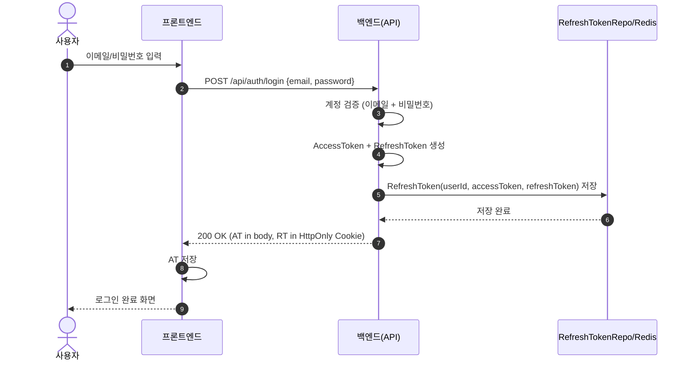
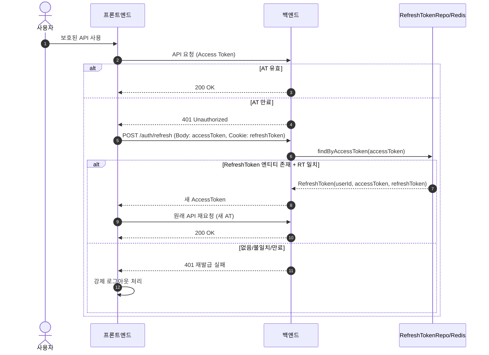

문서명: `auth-jwt-flow-redis.md`

---

# JWT 기반 인증 시스템 (Access Token · Refresh Token · Redis)

> MindMate 백엔드에서 구현한 **이메일/비밀번호 기반 로그인 + JWT 인증 구조** 문서입니다.
> Refresh Token 저장, 재발급, 필터 구조, 예외 처리까지 전체 흐름을 정리합니다.
> 소셜 로그인, 이메일 인증, 프로필 기능은 별도 문서에서 다룹니다.

---

# 1. 개요

MindMate의 인증 구조는 **세션 기반이 아닌 완전한 JWT 무상태 인증**을 사용한다.

-   Access Token → 짧은 주기 인증용 (subject = userId)
-   Refresh Token → Redis(또는 Redis 기반 Repository)에 저장되는 장기 인증용
-   Axios 인터셉터 → 401 감지 → 자동 재발급 요청
-   Spring Security + Custom JWT Filter 기반

**핵심 목표**

-   확실한 토큰 수명 관리
-   예측 가능한 에러 응답
-   RefreshToken 엔티티 기반의 안정적인 재발급 구조
-   프론트/백엔드 간 책임 분리가 명확한 인증 구조

---

# 2. 로그인 · 토큰 발급 흐름

## 2.1 전체 흐름 요약

1. 사용자가 이메일/비밀번호로 로그인
2. 비밀번호 검증 성공
3. Access Token + Refresh Token 생성
4. RefreshToken 엔티티에 `userId + accessToken + refreshToken` 저장
5. 응답:

    - Access Token → Body
    - Refresh Token → HttpOnly Cookie

## 2.2 Sequence Diagram (로그인 → RT 저장 → 로그인 완료)



---

# 3. 토큰 만료 · 재발급 흐름

프론트는 모든 API 요청에 Access Token을 포함한다.
만료되면 401을 받고 Axios 인터셉터에서 자동 재발급을 시도한다.

## 3.1 재발급 조건

-   Refresh Token이 HttpOnly Cookie에 존재해야 함
-   RefreshToken 저장소에 **해당 Access Token으로 저장된 엔티티가 있어야 함**
-   저장된 Refresh Token과 쿠키의 Refresh Token이 일치해야 함
-   Refresh Token이 만료되지 않아야 함

## 3.2 Sequence Diagram (AT 만료 → 재발급 → 재시도 / 실패)



---

# 4. 서버 구성 요소

## 4.1 핵심 컴포넌트

| 컴포넌트                           | 역할                                                              |
| ---------------------------------- | ----------------------------------------------------------------- |
| **AuthController**                 | `/signup`, `/login`, `/refresh`, `/logout` 엔드포인트 제공        |
| **AccountService**                 | 로그인, 토큰 재발급, 로그아웃 등 인증 관련 비즈니스 로직          |
| **JwtUtil**                        | JWT 생성·검증, 헤더에서 토큰 추출, userId(subject) 추출           |
| **JwtAuthenticationFilter**        | 요청 헤더에서 AT 추출 → 검증 → SecurityContext에 인증 정보 저장   |
| **RefreshTokenRepository/Service** | RefreshToken(userId, accessToken, refreshToken) 저장 및 조회/삭제 |
| **UserRepository**                 | 사용자 정보 조회                                                  |

---

# 5. 토큰 전략

## 5.1 Access Token / Refresh Token 구분

| 종류              | 역할        | 저장 위치                             | 내용 / 만료                     |
| ----------------- | ----------- | ------------------------------------- | ------------------------------- |
| **Access Token**  | 인증/인가   | 브라우저 스토리지/메모리              | subject = userId, 짧게(분 단위) |
| **Refresh Token** | AT 재발급용 | HttpOnly Cookie + RefreshToken 엔티티 | claim 없음, 길게(일~주 단위)    |

-   Access Token은 JWT의 `subject`에 **userId 하나만** 포함한다.
-   Refresh Token은 별도의 클레임을 넣지 않고, **서명된 난수 토큰**으로 사용한다.
-   Refresh Token의 의미 있는 정보(userId, accessToken 매핑)는 **RefreshToken 엔티티**에 저장한다.

## 5.2 RefreshToken 저장 구조

코드 기준 실제 구조:

```text
Entity: RefreshToken
- userId       : Long
- accessToken  : String
- refreshToken : String
```

조회 방식:

```java
Optional<RefreshToken> findByAccessToken(String accessToken);
```

정책:

-   한 Access Token에 대해 **쌍을 이루는 Refresh Token 하나**만 저장한다.
-   재발급 시:

    -   Body로 전달된 accessToken으로 엔티티 조회
    -   Cookie의 refreshToken과 엔티티의 refreshToken을 비교

-   Access Token 또는 Refresh Token 중 하나라도 누락/불일치하면 재발급 실패로 처리한다.

이 구조로 인해:

-   Refresh Token 자체가 탈취되더라도,
    해당 토큰과 함께 사용되던 Access Token까지 알아야 재발급 시도가 가능하다.
-   Refresh Token에는 userId 같은 식별 정보를 직접 담지 않는다.
    → 정보 노출은 저장소(Repository) 쪽에서만 관리한다.

---

# 6. API 상세

## 6.1 로그인 `POST /api/auth/login`

### 요청

```json
{ "username": "email@example.com", "password": "12345678" }
```

### 처리

1. 이메일로 사용자 조회
2. `PasswordEncoder.matches()`로 비밀번호 검증
3. Access Token 생성 (subject = userId)
4. Refresh Token 생성 (claim 없이 순수 토큰)
5. `RefreshToken(userId, accessToken, refreshToken)` 저장
6. Refresh Token을 HttpOnly Cookie로 설정

### 응답

```json
{ "accessToken": "<AT>" }
```

-   Body: Access Token
-   Cookie: Refresh Token (HttpOnly)

---

## 6.2 회원가입 `POST /api/auth/signup`

### 처리

-   이메일 중복 체크
-   비밀번호 BCrypt 해시 저장
-   User 등 엔티티 생성
-   필요 시 첫 로그인과 동일하게 AT/RT 발급
-   RT를 쿠키에 저장

> 이메일 인증 로직은 별도 문서(email-service)에서 설명.

---

## 6.3 토큰 재발급 `POST /api/auth/refresh`

### 요청

-   Body: `{ "accessToken": "..." }`
-   Cookie: `refreshToken={RT}`

### 처리

1. Body의 accessToken으로 `RefreshToken` 엔티티 조회
2. 엔티티가 없으면 재발급 실패
3. 쿠키의 refreshToken과 엔티티의 refreshToken 문자열 비교
4. 둘 다 일치하고 만료되지 않았다면 새 Access Token 발급
5. 필요 시 Refresh Token도 교체(전략에 따라 유지/갱신)
6. 불일치/만료/조회 실패 시 → 강제 로그아웃 유도(401 응답)

---

## 6.4 로그아웃 `POST /api/auth/logout`

### 처리

1. 헤더의 Access Token에서 순수 토큰 추출
2. 해당 accessToken으로 `RefreshToken` 엔티티 조회
3. 존재한다면 삭제
4. 응답 시 Refresh Token 쿠키를 삭제 (Max-Age=0 등)

로그아웃 결과:

-   이후 동일 Access Token으로는 인증 불가
-   해당 Access Token과 묶인 Refresh Token 조합도 더 이상 사용할 수 없음

---

# 7. Spring Security & JWT 필터 구조

## 7.1 Security 설정 요약

-   `/auth/login`, `/auth/signup`, 소셜 callback 등은 `permitAll`
-   나머지 `/api/**` 엔드포인트는 인증 필요
-   `JwtAuthenticationFilter`를 `UsernamePasswordAuthenticationFilter` 앞에 등록

## 7.2 JwtAuthenticationFilter 흐름

1. Authorization 헤더에서 `"Bearer <token>"` 형식 추출
2. 순수 토큰 문자열 파싱
3. `JwtUtil`을 통해 서명/만료 여부 검증
4. 유효한 토큰이면 `subject(userId)`로 사용자 조회
5. `Authentication` 객체 생성 후 `SecurityContextHolder`에 저장
6. 실패 시:

    - 토큰 없음/형식 오류/위조 → 401 또는 공통 예외 처리
    - 만료의 경우 프론트에서 재발급 요청을 유도할 수 있도록 응답

---

# 8. 예외 처리 정책

## Access Token

| 상황           | 응답 코드 | 메시지 예시          | 처리 방향              |
| -------------- | --------- | -------------------- | ---------------------- |
| 만료           | 401       | ACCESS_TOKEN_EXPIRED | 프론트에서 재발급 시도 |
| 위조/형식 오류 | 401/403   | INVALID_TOKEN        | 즉시 로그아웃/재로그인 |

## Refresh Token

| 상황                    | 응답 코드 | 메시지 예시             | 처리 방향     |
| ----------------------- | --------- | ----------------------- | ------------- |
| 엔티티 없음             | 401       | REFRESH_TOKEN_NOT_FOUND | 재로그인 요구 |
| 쿠키 RT와 엔티티 불일치 | 401       | REFRESH_TOKEN_MISMATCH  | 재로그인 요구 |
| 만료                    | 401       | REFRESH_TOKEN_EXPIRED   | 재로그인 요구 |

---

# 9. 보안/운영 고려사항

-   `jwt.secret`, DB, Redis, S3 Key 등은 `.env` 또는 외부 설정으로 분리
-   Refresh Token Cookie:

    -   `HttpOnly` 필수
    -   HTTPS 환경에서는 `Secure` 옵션 적용

-   RefreshToken 저장소 장애:

    -   재발급 불가 시, 프론트에 재로그인 유도

-   Docker 기반 배포 시:

    -   백엔드 컨테이너와 Redis 컨테이너는 내부 네트워크로만 통신
    -   외부에서 Redis 접근 불가하도록 보안 그룹/포트 제한

---

# 10. 회고 · 개선 포인트

-   단순 로그인/토큰 발급이 아니라 **운영 가능한 토큰 재발급 구조**를 직접 설계했다.
-   Access Token / Refresh Token을 분리하고, RefreshToken 엔티티로 AT-RT 쌍을 관리한다.
-   예외 상황(만료, 불일치, 저장소 장애)에 대해 일관된 응답 패턴을 가지도록 설계했다.

향후 개선 가능성:

-   기기별 Refresh Token 관리 (디바이스별 로그인)
-   비밀번호 변경/회원탈퇴 시 해당 사용자의 RT 일괄 무효화
-   관리자/사용자 권한별 토큰 정책 세분화
-   블랙리스트 또는 토큰 버전 필드를 활용한 강제 로그아웃 강화
