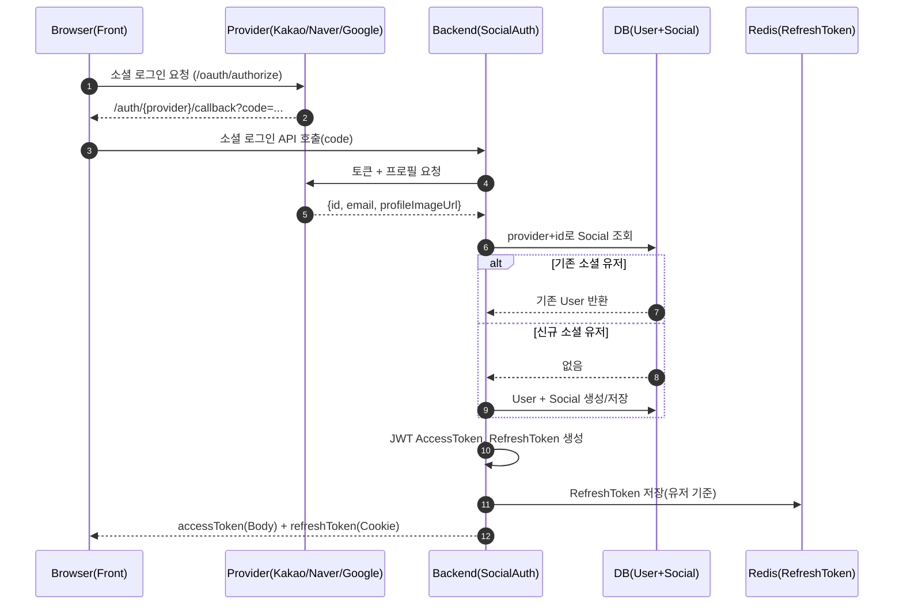
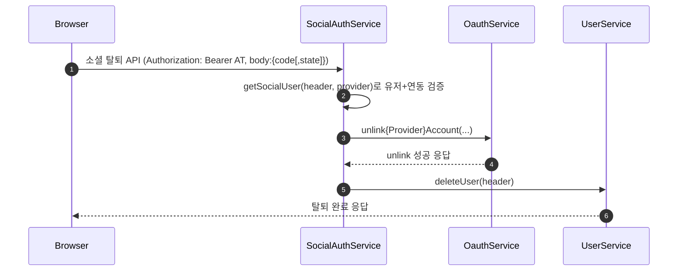

# 소셜 로그인 시스템 (Kakao · Naver · Google)

> MindMate에서 지원하는 **카카오 / 네이버 / 구글 소셜 로그인** 구조를 정리한 문서이다.
> 인가 코드 → 액세스 토큰 → 소셜 프로필 조회 → `User`/`Social` 생성 → JWT 발급,
> 그리고 이메일 중복·소셜 unlink·회원탈퇴 연동까지를 다룬다.

---

## 1. 개요

소셜 로그인은 다음 요구사항을 기준으로 설계되었다.

-   Kakao / Naver / Google **OAuth2 기반 로그인**
-   소셜 프로필의 **이메일을 필수 식별 키로 사용**
-   신규 소셜 로그인 시:

    -   `Social(provider, providerUserId)` 엔티티 생성/재사용
    -   `User` 엔티티 생성
    -   이메일 + 프로필 이미지 URL 저장
    -   `authType` = `KAKAO` / `NAVER` / `GOOGLE`

-   우리 서비스에서 자체 **JWT(Access / Refresh Token)** 발급 (로컬 로그인과 동일 전략)
-   **이메일 중복 시 소셜 계정 unlink 후 로그인 실패 처리**
-   소셜 회원탈퇴 시, **소셜 unlink + 우리 서비스 회원탈퇴**를 하나의 플로우로 처리

백엔드의 진입점은 `SocialAuthService`이며,
카카오/네이버/구글별 OAuth 호출은 각각 `KakaoOauthService`, `NaverOauthService`, `GoogleOauthService`에서 담당한다.

---

## 2. 전체 플로우

### 2.1 로그인 플로우



---

### 2.2 소셜 회원탈퇴(소셜 unlink + 서비스 탈퇴)



---

## 3. 도메인 구조 및 핵심 정책

### 3.1 `User` – `Social` 관계

-   `User`

    -   주요 필드: `id`, `email`, `authType`, `profileImageUrl`, …
    -   소셜 가입 시:

        -   `email` ← 소셜 계정 이메일
        -   `authType` ← `"KAKAO"`, `"NAVER"`, `"GOOGLE"`
        -   `profileImageUrl` ← 소셜 프로필 이미지 URL

-   `Social`

    -   주요 필드: `provider`, `providerUserId`, `user`
    -   `provider` : `"KAKAO"`, `"NAVER"`, `"GOOGLE"`
    -   `providerUserId` : 각 소셜 계정의 고유 ID

관계 요약:

-   `User 1 : 1 Social`
-   소셜 로그인 시 항상 `Social`을 통해 `User`를 찾거나 생성한다.

### 3.2 공통 헬퍼: `getOrCreateSocial`

```java
private Social getOrCreateSocial(String provider, String providerUserId) {
    return socialRepository
        .findByProviderAndProviderUserId(provider, providerUserId)
        .orElseGet(() -> {
            Social social = new Social();
            social.setProvider(provider);
            social.setProviderUserId(providerUserId);
            return social;
        });
}
```

-   `provider + providerUserId` 기준으로 소셜 계정을 찾고,
-   없으면 새 `Social` 인스턴스를 만들어 이후 `User`와 연결한다.

---

## 4. 공통 비즈니스 로직

### 4.1 이메일 기반 신규/기존 User 처리

```java
private User getOrCreateUserForSocial(Social social, String email, String profileImageUrl) {
    User existing = social.getUser();
    if (existing != null) {
        return existing;
    }

    if (email == null || email.isBlank()) {
        throw new IllegalArgumentException(
            "이메일 정보를 가져올 수 없습니다. 소셜 계정의 이메일 제공에 동의했는지 확인해주세요."
        );
    }

    if (userRepository.findByEmail(email).isPresent()) {
        throw new IllegalArgumentException("이미 이 이메일로 가입된 계정이 있습니다.");
    }

    User user = new User();
    social.setUser(user);
    user.setSocial(social);
    user.setEmail(email);
    user.setAuthType(social.getProvider());
    user.setProfileImageUrl(profileImageUrl);

    userRepository.save(user);
    return user;
}
```

정책 요약:

-   이미 `Social`에 연결된 `User`가 있으면 그대로 사용 (기존 소셜 로그인)
-   이메일 없음 → 예외 발생 → 400 계열 응답으로 안내
-   이메일 중복 → 예외 발생
    → 각 provider별로 **해당 소셜 계정 unlink** 후 409 응답

---

### 4.2 JWT 발급 공통 로직

```java
private Map<String, String> issueTokensForUser(User user, HttpServletResponse response) {
    Long userId = user.getId();
    if (userId == null) {
        throw new IllegalStateException("유저 ID가 없습니다.");
    }

    String accessToken = jwtUtil.createAccessToken(userId);
    String refreshToken = jwtUtil.createRefreshToken();

    refreshTokenService.saveTokenInfo(userId, refreshToken, accessToken);

    ResponseCookie refreshCookie = ResponseCookie.from("refreshToken", refreshToken)
            .httpOnly(true)
            .secure(false)    // 로컬: false, HTTPS 배포 시 true
            .sameSite("Lax")
            .path("/")
            .build();

    response.addHeader("Set-Cookie", refreshCookie.toString());

    Map<String, String> result = new HashMap<>();
    result.put("accessToken", accessToken);
    return result;
}
```

-   로그인 성공 시:

    -   Access / Refresh Token 생성
    -   `RefreshTokenService`를 통해 Redis에 저장
    -   Refresh Token은 **HttpOnly Cookie**로 전송

-   JWT 자체 구조, Redis 키 전략 등은 `auth-jwt.md` 문서에서 공통 관리.

---

## 5. 프로바이더별 로그인

### 5.1 공통 흐름

각 메서드는 구조가 같다.

1. 프론트로부터 `code`(및 `state`) 수신
2. 각 `OauthService`에서 **액세스 토큰 발급**
3. 액세스 토큰으로 **소셜 프로필 조회** (id, email, profileImageUrl 등)
4. `Social` 조회/생성 (`getOrCreateSocial`)
5. `User` 조회/생성 (`getOrCreateUserForSocial`)
6. JWT + Refresh Token 발급 (`issueTokensForUser`)

### 5.2 예외 및 HTTP 응답 정책

```java
private ResponseEntity<?> handleSocialLoginException(IllegalArgumentException e) {
    String msg = e.getMessage();

    if ("이미 이 이메일로 가입된 계정이 있습니다.".equals(msg)) {
        return ResponseEntity.status(HttpStatus.CONFLICT).body(msg);
    }
    if (msg != null && msg.startsWith("이메일 정보를 가져올 수 없습니다")) {
        return ResponseEntity.status(HttpStatus.BAD_REQUEST).body(msg);
    }
    return ResponseEntity.status(HttpStatus.UNAUTHORIZED).body(msg);
}
```

-   이메일 중복 → 409 CONFLICT (+ 소셜 계정 unlink)
-   이메일 미제공 → 400 BAD_REQUEST
-   그 외 인증/권한 관련 문제 → 401 UNAUTHORIZED

---

### 5.3 Kakao

핵심 포인트:

-   `kakaoLogin(code, response)`에서:

    -   `fetchAccessToken(code, kakaoRedirectUriLogin)`으로 Bearer 토큰 발급
    -   `/v2/user/me`로 프로필 조회
    -   `kakao_account.email`, `kakao_account.profile.profile_image_url` 추출

-   `Social(provider="KAKAO", providerUserId=id)` 기준으로 `Social` 조회/생성
-   이메일 중복 시:

    -   `unlinkKakaoAccountByToken(bearerToken)` 호출
    -   이후 409 응답

---

### 5.4 Naver

핵심 포인트:

-   `naverLogin(code, state, response)`에서:

    -   `fetchAccessToken(code, state, naverRedirectUriLogin)` 호출
    -   사용자 정보 응답에서 `id`, `email`, `profile_image` 추출

-   `Social(provider="NAVER", providerUserId=id)` 기준으로 처리
-   이메일 중복 시:

    -   `unlinkNaverAccountByToken(bearerToken)` 호출
    -   409 응답

`state` 값은 CSRF 방지를 위한 파라미터로 사용 가능하며,
현재는 **요청/응답에 포함시키는 수준**에서 사용하고 있다(서버 검증 로직은 향후 확장 포인트).

---

### 5.5 Google

핵심 포인트:

-   `googleLogin(code, response)`에서:

    -   `fetchAccessToken(code, googleRedirectUriLogin)`으로 액세스 토큰 발급
    -   userinfo API에서 `sub`, `email`, `picture` 조회

-   `Social(provider="GOOGLE", providerUserId=sub)` 기준으로 처리
-   이메일 중복 시:

    -   `unlinkGoogleAccountByToken(accessToken)` 호출
    -   409 응답

---

## 6. 소셜 회원탈퇴 (unlink + 서비스 탈퇴)

### 6.1 공통 유저 검증: `getSocialUser`

```java
private User getSocialUser(String header, String provider) {
    Long userId = jwtUtil.findUserIdByHeader(header);
    if (userId == null) {
        throw new IllegalArgumentException("토큰 정보가 없습니다.");
    }

    User user = userRepository.findById(userId)
            .orElseThrow(() -> new IllegalArgumentException("사용자를 찾을 수 없습니다."));

    Social social = user.getSocial();
    if (social == null || !provider.equalsIgnoreCase(social.getProvider())) {
        throw new IllegalArgumentException(provider + " 연동 계정이 아닙니다.");
    }
    return user;
}
```

-   Access Token → `userId` 추출
-   `User` 조회 후 해당 provider와 실제 연동 여부 검증

### 6.2 Kakao / Naver / Google 회원탈퇴 공통 패턴

각 메서드(`kakaoDelete`, `naverDelete`, `googleDelete`)는 모두 다음 패턴을 따른다.

1. `getSocialUser(header, "{PROVIDER}")`로 현재 유저가 해당 소셜과 연동된 계정인지 확인
2. 프론트에서 전달한 `code`(및 `state`)로 다시 소셜 측 토큰 발급
3. 각 provider의 unlink / revoke API 호출
4. 성공 시 `userService.deleteUser(header)` 호출로

    - 유저 비식별 처리
    - 관련 데이터 정리

이로써 **소셜 계정 연결 해제와 서비스 탈퇴를 항상 함께 보장**한다.

---

## 7. 프론트엔드 연동 개요

> 이 섹션은 구현 세부 코드가 아닌 “규칙”만 정리한다.

-   프론트는 provider별로 **로그인 / 탈퇴용 인증 URL을 직접 구성**한다.
-   공통 규칙:

    -   로그인 redirect: `/auth/{provider}/callback`
    -   탈퇴 redirect: `/auth/{provider}/delete-callback`
    -   이 값들은 백엔드 `sns.{provider}.redirect-uri-login/delete` 설정과 1:1 대응

-   `state`:

    -   Kakao: 선택적으로 사용 가능
    -   Naver / Google: `state`를 생성해 함께 전달
    -   현재 서버에서 CSRF 검증은 강제하지 않지만, 향후 강화 포인트로 남겨둠

삭제 콜백 페이지에서는 쿼리 파라미터에서 `code`(및 `state`)를 파싱해
`kakaoDelete/naverDelete/googleDelete` API에 전달한다.

---

## 8. 예외 및 운영 고려사항

-   **이메일 제공에 미동의한 소셜 계정**

    -   이메일 추출 실패 → 400 응답 + “이메일 제공 동의 필요” 안내

-   **이메일 중복**

    -   이미 동일 이메일로 가입된 계정 존재 시:

        -   해당 소셜 계정을 즉시 unlink
        -   우리 서비스에는 로그인시키지 않고 409 응답으로 종료

-   **토큰/유저 정보 없음**

    -   `"토큰 정보가 없습니다."`, `"사용자를 찾을 수 없습니다."` 등 → 400/401 계열 응답

-   **소셜 인증 서버 오류**

    -   외부 API 실패, URISyntaxException 등 → 500 응답
        (메시지에 어떤 provider에서 오류가 났는지 포함)

JWT, Redis, Refresh Token 쿠키(`httpOnly`, `secure`)에 대한 상세 전략은
**JWT 인증 문서(`auth-jwt.md`)**에서 공통으로 관리한다.

---

## 9. 정리

소셜 로그인 시스템의 핵심 요약:

-   Kakao / Naver / Google OAuth2를 **하나의 통일된 패턴**으로 처리
-   `Social(provider, providerUserId)`를 통해 소셜 계정과 `User`를 1:1 매핑
-   최초 소셜 가입 시 **이메일 + 프로필 이미지 URL**까지 저장해 초기 프로필 세팅
-   이메일 중복 시 **소셜 계정 unlink + 409 응답**으로, 계정 혼선 방지
-   소셜 회원탈퇴 시 **외부 unlink + 내부 회원탈퇴**를 항상 연동
-   토큰 발급·보안은 로컬 로그인과 동일한 **JWT + Redis 구조**를 재사용

이 문서는 이후 작성할 **회원가입 / 프로필 설정(S3 이미지 업로드)** 문서에서
“소셜 로그인으로 생성된 User”를 전제로 이어지는 기반이 된다.
