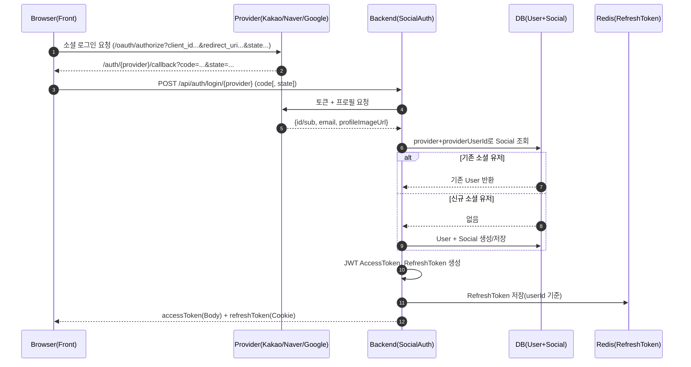
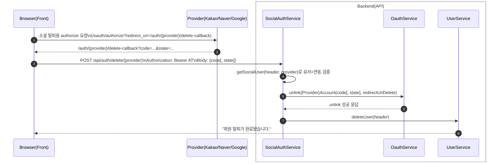

# 소셜 로그인 시스템 (Kakao · Naver · Google)

> MindMate에서 지원하는 **카카오 / 네이버 / 구글 소셜 로그인** 구조를 정리한 문서이다.  
> 인가 코드 → 액세스 토큰 → 소셜 프로필 조회 → `User`/`Social` 생성 → JWT 발급,  
> 그리고 이메일 중복·소셜 unlink·회원탈퇴 연동까지를 다룬다.  
> JWT 발급·검증, Refresh Token + Redis 전략은 `auth-jwt-flow-redis.md` 문서를 전제로 한다.

---

## 1. 개요

소셜 로그인은 다음 요구사항을 기준으로 설계되었다.

-   Kakao / Naver / Google **OAuth2 기반 로그인**
-   소셜 프로필의 **이메일을 필수 식별 키로 사용**
-   신규 소셜 로그인 시:
    -   `Social(provider, providerUserId)` 엔티티 생성/재사용
    -   `User` 엔티티 생성
    -   이메일 + 프로필 이미지 URL 저장
    -   `authType` = `KAKAO` / `NAVER` / `GOOGLE`
-   우리 서비스에서 자체 **JWT(Access / Refresh Token)** 발급 (로컬 로그인과 동일 전략)
-   **이메일 중복 시 소셜 계정 unlink 후 로그인 실패 처리**
-   소셜 회원탈퇴 시, **소셜 unlink + 우리 서비스 회원탈퇴**를 하나의 플로우로 처리

백엔드의 진입점은 `SocialAuthService`이며,  
카카오/네이버/구글별 OAuth 호출은 각각

-   `KakaoOauthService`
-   `NaverOauthService`
-   `GoogleOauthService`

에서 담당한다.

프론트엔드는 다음 두 축으로 구성된다.

-   **로그인 콜백 페이지**
    -   `/auth/kakao/callback`, `/auth/naver/callback`, `/auth/google/callback`
    -   쿼리의 `code`(및 `state`)를 파싱해 `/api/auth/login/{type}`으로 전달
    -   React Strict Mode 2회 렌더를 막기 위해 `calledRef`로 중복 호출 방지
-   **탈퇴 콜백 페이지**
    -   `/auth/kakao/delete-callback`, `/auth/naver/delete-callback`, `/auth/google/delete-callback`
    -   `code`(및 `state`)를 받아 `/api/auth/delete/{type}`으로 전달

---

## 2. 전체 플로우

### 2.1 로그인 플로우



**프론트 측 특징**

-   소셜 로그인 버튼 클릭 시, `buildKakaoAuthUrl / buildNaverAuthUrl / buildGoogleAuthUrl`로 인증 URL 생성

    -   공통적으로 `client_id`, `redirect_uri`, `response_type=code`, `scope`, `state` 등을 포함

-   Google/Naver는 `state`를 생성해 `sessionStorage`에 저장 후 전달
-   callback 컴포넌트들은 모두

    ```js
    const calledRef = useRef(false);
    if (calledRef.current) return;
    calledRef.current = true;
    ```

    로 **중복 호출을 방지**한다.

---

### 2.2 소셜 회원탈퇴(소셜 unlink + 서비스 탈퇴)

소셜 탈퇴는 로그인과 마찬가지로 **별도의 OAuth 인증 과정을 한 번 더 밟는다.**



-   **중요 포인트**

    -   로그인과 탈퇴는 **서로 다른 redirect-uri**와 code를 사용한다.
    -   각 provider별 `redirect-uri-delete`는 설정 파일에서 분리 관리:

        -   `sns.kakao.redirect-uri-delete`
        -   `sns.naver.redirect-uri-delete`
        -   `sns.google.redirect-uri-delete`

---

## 3. 도메인 구조 및 핵심 정책

### 3.1 `User` – `Social` 관계

-   `User`

    -   주요 필드: `id`, `email`, `authType`, `profileImageUrl`, `nickname`, `birth_date`, `mbti`, ...
    -   소셜 가입 시:

        -   `email` ← 소셜 계정 이메일
        -   `authType` ← `"KAKAO"`, `"NAVER"`, `"GOOGLE"`
        -   `profileImageUrl` ← 소셜 프로필 이미지 URL

-   `Social`

    -   주요 필드: `provider`, `providerUserId`, `user`
    -   `provider` : `"KAKAO"`, `"NAVER"`, `"GOOGLE"`
    -   `providerUserId` : 각 소셜 계정의 고유 ID (`Kakao.id`, `Naver.id`, `Google.sub`)

관계 요약:

-   `User 1 : 1 Social`
-   소셜 로그인 시 항상 `Social`을 통해 `User`를 찾거나 생성한다.

---

### 3.2 공통 헬퍼: `getOrCreateSocial`

```java
private Social getOrCreateSocial(String provider, String providerUserId) {
    return socialRepository
            .findByProviderAndProviderUserId(provider, providerUserId)
            .orElseGet(() -> {
                Social social = new Social();
                social.setProvider(provider);
                social.setProviderUserId(providerUserId);
                return social;
            });
}
```

Provider별 래핑:

```java
private Social getOrCreateKakaoSocial(LinkedHashMap<String, Object> kakaoUser) {
    Long kakaoId = ((Number) kakaoUser.get("id")).longValue();
    String providerUserId = String.valueOf(kakaoId);
    return getOrCreateSocial("KAKAO", providerUserId);
}

private Social getOrCreateNaverSocial(LinkedHashMap<String, Object> naverUser) {
    String providerUserId = String.valueOf(naverUser.get("id"));
    return getOrCreateSocial("NAVER", providerUserId);
}

private Social getOrCreateGoogleSocial(LinkedHashMap<String, Object> googleUser) {
    String providerUserId = String.valueOf(googleUser.get("sub"));
    return getOrCreateSocial("GOOGLE", providerUserId);
}
```

---

## 4. 공통 비즈니스 로직

### 4.1 이메일 기반 `User` 생성·검증: `getOrCreateUserForSocial`

```java
private User getOrCreateUserForSocial(Social social,
                                      String email,
                                      String profileImageUrl) {
    User existing = social.getUser();
    if (existing != null) {
        return existing;
    }

    if (email == null || email.isBlank()) {
        throw new IllegalArgumentException(
            "이메일 정보를 가져올 수 없습니다. 소셜 계정의 이메일 제공에 동의했는지 확인해주세요."
        );
    }

    if (userRepository.findByEmail(email).isPresent()) {
        throw new IllegalArgumentException("이미 이 이메일로 가입된 계정이 있습니다.");
    }

    User user = new User();
    social.setUser(user);
    user.setSocial(social);
    user.setEmail(email);
    user.setAuthType(social.getProvider());
    user.setProfileImageUrl(profileImageUrl);

    userRepository.save(user);
    return user;
}
```

정책 요약:

-   이미 `Social`에 연결된 `User`가 있으면 그대로 사용 (기존 소셜 로그인)
-   이메일 없음 → 예외 발생 → 400 응답으로 안내
-   이메일 중복 → 예외 발생

    -   각 provider별로 **해당 소셜 계정 unlink** 후 409 응답

---

### 4.2 JWT 발급 공통 로직: `issueTokensForUser`

```java
private Map<String, String> issueTokensForUser(User user, HttpServletResponse response) {
    Long userId = user.getId();
    if (userId == null) {
        throw new IllegalStateException("유저 ID가 없습니다.");
    }

    String accessToken = jwtUtil.createAccessToken(userId);
    String refreshToken = jwtUtil.createRefreshToken();

    refreshTokenService.saveTokenInfo(userId, refreshToken, accessToken);

    ResponseCookie refreshCookie = ResponseCookie.from("refreshToken", refreshToken)
            .httpOnly(true)
            .secure(false)    // 로컬: false, HTTPS 배포 시 true
            .sameSite("Lax")
            .path("/")
            .build();

    response.addHeader("Set-Cookie", refreshCookie.toString());

    Map<String, String> result = new HashMap<>();
    result.put("accessToken", accessToken);
    return result;
}
```

-   로그인 성공 시:

    -   Access / Refresh Token 생성
    -   `RefreshTokenService`를 통해 Redis에 저장
    -   Refresh Token은 **HttpOnly Cookie**로 전송

-   JWT 구조·Redis 저장 전략은 `auth-jwt-flow-redis.md`와 동일

---

### 4.3 소셜 로그인 예외 처리 공통: `handleSocialLoginException`

```java
private ResponseEntity<?> handleSocialLoginException(IllegalArgumentException e) {
    String msg = e.getMessage();

    if ("이미 이 이메일로 가입된 계정이 있습니다.".equals(msg)) {
        return ResponseEntity.status(HttpStatus.CONFLICT).body(msg);
    }
    if (msg != null && msg.startsWith("이메일 정보를 가져올 수 없습니다")) {
        return ResponseEntity.status(HttpStatus.BAD_REQUEST).body(msg);
    }
    return ResponseEntity.status(HttpStatus.UNAUTHORIZED).body(msg);
}
```

-   이메일 중복 → 409 CONFLICT
-   이메일 미제공 → 400 BAD_REQUEST
-   그 외 인증 관련 오류 → 401 UNAUTHORIZED

로그인 시 이메일 중복(409)일 경우, provider별로 **즉시 unlink** 시도 후 이 응답을 돌려준다.

---

## 5. 프로바이더별 로그인

### 5.1 공통 컨트롤러 엔드포인트

```java
@GetMapping("/login/{type}")
public ResponseEntity<?> socialLogin(
        @PathVariable("type") String type,
        @RequestParam("code") String code,
        @RequestParam(value = "state", required = false) String state,
        HttpServletResponse response
) {
    String lowerType = type.toLowerCase();

    switch (lowerType) {
        case "kakao":
            return socialAuthService.kakaoLogin(code, response);
        case "naver":
            if (state == null || state.isBlank()) {
                return ResponseEntity.badRequest().body("네이버 state 값이 없습니다.");
            }
            return socialAuthService.naverLogin(code, state, response);
        case "google":
            return socialAuthService.googleLogin(code, response);
        default:
            return ResponseEntity.badRequest().body("지원하지 않는 로그인 타입입니다: " + type);
    }
}
```

프론트 콜백 페이지는 모두 위 엔드포인트를 호출한다.

---

### 5.2 Kakao 로그인

핵심 포인트:

-   토큰 발급: `fetchAccessToken(code, kakaoRedirectUriLogin)`

    -   Kakao 토큰 요청 시:

        -   `grant_type=authorization_code`
        -   `client_id`, `client_secret`, `redirect_uri`, `code` 포함

    -   응답의 `access_token` 앞에 `"Bearer "`를 붙여 사용

-   유저 조회: `fetchKakaoUser(bearerToken)` → `/v2/user/me`

    -   `id`, `kakao_account.email`, `kakao_account.profile.profile_image_url` 추출

-   Social/User 생성 후 `issueTokensForUser` 호출

```java
public ResponseEntity<?> kakaoLogin(String code, HttpServletResponse response) {
    String bearerToken = null;
    try {
        bearerToken = kakaoOauthService.fetchAccessToken(code, kakaoRedirectUriLogin);
        if (bearerToken == null || bearerToken.isBlank()) {
            throw new IllegalArgumentException("카카오 토큰 발급 실패");
        }

        LinkedHashMap<String, Object> kakaoUser = kakaoOauthService.fetchKakaoUser(bearerToken);
        if (kakaoUser == null || !kakaoUser.containsKey("id")) {
            throw new IllegalArgumentException("카카오 사용자 정보를 가져올 수 없습니다.");
        }

        String email = kakaoOauthService.extractEmailFromUser(kakaoUser);
        String profileImageUrl = kakaoOauthService.extractProfileImageFromUser(kakaoUser);

        Social social = getOrCreateKakaoSocial(kakaoUser);
        User user = getOrCreateUserForSocial(social, email, profileImageUrl);

        Map<String, String> result = issueTokensForUser(user, response);
        return new ResponseEntity<>(result, HttpStatus.OK);

    } catch (IllegalArgumentException e) {
        String msg = e.getMessage();
        // 이메일 중복일 때만 unlink
        if ("이미 이 이메일로 가입된 계정이 있습니다.".equals(msg)) {
            try {
                if (bearerToken != null && !bearerToken.isBlank()) {
                    kakaoOauthService.unlinkKakaoAccountByToken(bearerToken);
                }
            } catch (Exception unlinkEx) {
                unlinkEx.printStackTrace();
            }
        }

        return handleSocialLoginException(e);
    } catch (URISyntaxException e) {
        return ResponseEntity.status(HttpStatus.INTERNAL_SERVER_ERROR).body("카카오 인증 서버 요청 오류");
    } catch (Exception e) {
        e.printStackTrace();
        return ResponseEntity.status(HttpStatus.INTERNAL_SERVER_ERROR).body("카카오 로그인 처리 중 서버 오류");
    }
}
```

---

### 5.3 Naver 로그인

-   토큰 발급: `fetchAccessToken(code, state, naverRedirectUriLogin)`

    -   `grant_type=authorization_code`
    -   `client_id`, `client_secret`, `code`, `state`, `redirect_uri`

-   유저 조회: `fetchNaverUser(bearerToken)`

    -   내부에서 `response` 필드를 파싱해 `{id, email, profile_image}` 추출

-   Social/User 생성 후 `issueTokensForUser` 호출

```java
public ResponseEntity<?> naverLogin(String code, String state, HttpServletResponse response) {
    String bearerToken = null;
    try {
        bearerToken = naverOauthService.fetchAccessToken(code, state, naverRedirectUriLogin);
        if (bearerToken == null || bearerToken.isBlank()) {
            throw new IllegalArgumentException("네이버 토큰 발급 실패");
        }

        LinkedHashMap<String, Object> naverUser = naverOauthService.fetchNaverUser(bearerToken);
        String email = naverOauthService.extractEmailFromUser(naverUser);
        String profileImageUrl = naverOauthService.extractProfileImageFromUser(naverUser);

        Social social = getOrCreateNaverSocial(naverUser);
        User user = getOrCreateUserForSocial(social, email, profileImageUrl);

        Map<String, String> result = issueTokensForUser(user, response);
        return new ResponseEntity<>(result, HttpStatus.OK);

    } catch (IllegalArgumentException e) {
        String msg = e.getMessage();
        if ("이미 이 이메일로 가입된 계정이 있습니다.".equals(msg)) {
            try {
                if (bearerToken != null && !bearerToken.isBlank()) {
                    naverOauthService.unlinkNaverAccountByToken(bearerToken);
                }
            } catch (Exception unlinkEx) {
                unlinkEx.printStackTrace();
            }
        }
        return handleSocialLoginException(e);
    } catch (URISyntaxException e) {
        return ResponseEntity.status(HttpStatus.INTERNAL_SERVER_ERROR).body("네이버 인증 서버 요청 오류");
    } catch (Exception e) {
        e.printStackTrace();
        return ResponseEntity.status(HttpStatus.INTERNAL_SERVER_ERROR).body("네이버 로그인 처리 중 서버 오류");
    }
}
```

---

### 5.4 Google 로그인

-   토큰 발급: `fetchAccessToken(code, googleRedirectUriLogin)`

    -   `client_id`, `client_secret`, `code`, `redirect_uri`, `grant_type=authorization_code`

-   유저 조회: `fetchGoogleUser(accessToken)`

    -   `sub`, `email`, `picture` 추출

-   Social/User 생성 후 `issueTokensForUser` 호출

```java
public ResponseEntity<?> googleLogin(String code, HttpServletResponse response) {
    String accessToken = null;
    try {
        accessToken = googleOauthService.fetchAccessToken(code, googleRedirectUriLogin);
        if (accessToken == null || accessToken.isBlank()) {
            throw new IllegalArgumentException("구글 토큰 발급 실패");
        }

        LinkedHashMap<String, Object> googleUser =
                googleOauthService.fetchGoogleUser(accessToken);

        String email = googleOauthService.extractEmailFromUser(googleUser);
        String profileImageUrl = googleOauthService.extractProfileImageFromUser(googleUser);

        Social social = getOrCreateGoogleSocial(googleUser);
        User user = getOrCreateUserForSocial(social, email, profileImageUrl);

        Map<String, String> result = issueTokensForUser(user, response);
        return new ResponseEntity<>(result, HttpStatus.OK);

    } catch (IllegalArgumentException e) {
        String msg = e.getMessage();
        if ("이미 이 이메일로 가입된 계정이 있습니다.".equals(msg)) {
            try {
                if (accessToken != null && !accessToken.isBlank()) {
                    googleOauthService.unlinkGoogleAccountByToken(accessToken);
                }
            } catch (Exception unlinkEx) {
                unlinkEx.printStackTrace();
            }
        }
        return handleSocialLoginException(e);
    } catch (URISyntaxException e) {
        return ResponseEntity.status(HttpStatus.INTERNAL_SERVER_ERROR).body("구글 인증 서버 요청 오류");
    } catch (Exception e) {
        e.printStackTrace();
        return ResponseEntity.status(HttpStatus.INTERNAL_SERVER_ERROR).body("구글 로그인 처리 중 서버 오류");
    }
}
```

---

## 6. 소셜 회원탈퇴 (unlink + 서비스 탈퇴)

### 6.1 공통 컨트롤러 엔드포인트

```java
@PostMapping("/delete/{type}")
public ResponseEntity<?> socialDelete(
        @RequestHeader("Authorization") String header,
        @PathVariable("type") String type,
        @RequestBody Map<String, String> body
) {
    String lowerType = type.toLowerCase();
    switch (lowerType) {
        case "kakao":
            return socialAuthService.kakaoDelete(header, body);
        case "naver":
            return socialAuthService.naverDelete(header, body);
        case "google":
            return socialAuthService.googleDelete(header, body);
        default:
            return ResponseEntity.badRequest().body("지원하지 않는 소셜 타입입니다: " + type);
    }
}
```

### 6.2 소셜 연동 유저 검증: `getSocialUser`

```java
private User getSocialUser(String header, String provider) {
    Long userId = jwtUtil.findUserIdByHeader(header);
    if (userId == null) {
        throw new IllegalArgumentException("토큰 정보가 없습니다.");
    }

    User user = userRepository.findById(userId)
            .orElseThrow(() -> new IllegalArgumentException("사용자를 찾을 수 없습니다."));

    Social social = user.getSocial();
    if (social == null || !provider.equalsIgnoreCase(social.getProvider())) {
        throw new IllegalArgumentException(provider + " 연동 계정이 아닙니다.");
    }

    return user;
}
```

---

### 6.3 Kakao 탈퇴

```java
@Transactional
public ResponseEntity<?> kakaoDelete(String header, Map<String, String> body) {
    try {
        User user = getSocialUser(header, "KAKAO");

        String code = requireParam(body, "code", "카카오 code 값이 없습니다.");

        kakaoOauthService.unlinkKakaoAccount(code, kakaoRedirectUriDelete);

        return userService.deleteUser(header);

    } catch (IllegalArgumentException e) {
        return ResponseEntity.badRequest().body(e.getMessage());
    } catch (URISyntaxException e) {
        e.printStackTrace();
        return new ResponseEntity<>("카카오 인증 서버 요청 오류", HttpStatus.INTERNAL_SERVER_ERROR);
    } catch (Exception e) {
        e.printStackTrace();
        return new ResponseEntity<>("카카오 회원탈퇴 처리 중 서버 오류", HttpStatus.INTERNAL_SERVER_ERROR);
    }
}
```

---

### 6.4 Naver 탈퇴

```java
@Transactional
public ResponseEntity<?> naverDelete(String header, Map<String, String> body) {
    try {
        User user = getSocialUser(header, "NAVER");

        String code = requireParam(body, "code", "네이버 code 값이 없습니다.");
        String state = requireParam(body, "state", "네이버 state 값이 없습니다.");

        naverOauthService.unlinkNaverAccount(code, state, naverRedirectUriDelete);

        return userService.deleteUser(header);

    } catch (IllegalArgumentException e) {
        return ResponseEntity.badRequest().body(e.getMessage());
    } catch (URISyntaxException e) {
        e.printStackTrace();
        return new ResponseEntity<>("네이버 인증 서버 요청 오류", HttpStatus.INTERNAL_SERVER_ERROR);
    } catch (Exception e) {
        e.printStackTrace();
        return new ResponseEntity<>("네이버 회원탈퇴 처리 중 서버 오류", HttpStatus.INTERNAL_SERVER_ERROR);
    }
}
```

---

### 6.5 Google 탈퇴

```java
@Transactional
public ResponseEntity<?> googleDelete(String header, Map<String, String> body) {
    try {
        User user = getSocialUser(header, "GOOGLE");

        String code = requireParam(body, "code", "구글 code 값이 없습니다.");

        googleOauthService.unlinkGoogleAccount(code, googleRedirectUriDelete);

        return userService.deleteUser(header);

    } catch (IllegalArgumentException e) {
        return ResponseEntity.badRequest().body(e.getMessage());
    } catch (URISyntaxException e) {
        e.printStackTrace();
        return new ResponseEntity<>("구글 인증 서버 요청 오류", HttpStatus.INTERNAL_SERVER_ERROR);
    } catch (Exception e) {
        e.printStackTrace();
        return new ResponseEntity<>("구글 회원탈퇴 처리 중 서버 오류", HttpStatus.INTERNAL_SERVER_ERROR);
    }
}
```

---

### 6.6 `deleteUser` 내부 처리 요약 (UserService)

소셜 탈퇴 이후에는 항상 `userService.deleteUser(header)`가 호출된다.

주요 처리:

-   Access Token에 매핑된 RefreshToken 엔티티 삭제 (`removeRefreshToken`)
-   S3에 저장된 해당 유저의 모든 이미지 삭제 (`deleteAllUserImages`)
-   `Account`, `Social`, `Diary`, `AIResult`, `AICharacter` 등 연관 데이터 삭제
-   유저 비식별 처리:

    -   `email` → `"@deleteEmail#"+userId`
    -   `nickname` → `"탈퇴회원#"+userId`
    -   `birth_date`, `mbti`, `profileImageUrl` 등을 null로 초기화

결과적으로:

-   JWT 관점: **Refresh Token 제거 + 토큰 재발급 불가**
-   도메인 관점: 유저 정보 비식별 + 연관 데이터 정리

> 실제 User 레코드는 삭제하지 않고, 이메일/닉네임을 마스킹한 뒤
> 연관 엔티티를 삭제하는 비식별 처리 방식으로 구현했다.

---

## 7. 프론트엔드 연동 규칙 요약

-   로그인 버튼:

    -   provider별 `build{Provider}AuthUrl`로 URL 생성 후 `window.location.href` 이동

-   콜백 페이지:

    -   `code`(+ `state`) 파싱
    -   `/api/auth/login/{provider}` 또는 `/api/auth/delete/{provider}` 호출
    -   React Strict Mode로 인한 중복 호출 방지:

        -   `calledRef`로 한 번만 실행되도록 구성

-   에러 처리:

    -   409(CONFLICT) → “이미 이 이메일로 가입된 계정이 있습니다.” 안내
    -   400(BAD_REQUEST) → “이메일 제공 동의 필요” 또는 code/state 누락 안내
    -   401/500 → 공통 에러 모달 또는 알림

---

## 8. 예외 및 운영 고려사항

-   **이메일 제공에 미동의한 소셜 계정**

    -   이메일 추출 실패 → 400 응답
    -   “이메일 정보를 가져올 수 없습니다. 소셜 계정의 이메일 제공에 동의했는지 확인해주세요.” 메시지 사용

-   **이메일 중복**

    -   이미 동일 이메일로 가입된 계정 존재 시:

        -   해당 소셜 계정 unlink 시도
        -   우리 서비스에는 로그인시키지 않고 409 응답으로 종료

-   **소셜 인증 서버 오류**

    -   URISyntaxException, 외부 API 실패 등 → 500 응답
    -   “{provider} 인증 서버 요청 오류”, “{provider} 로그인 처리 중 서버 오류” 메시지

-   **토큰/유저 정보 없음**

    -   `"토큰 정보가 없습니다."`, `"사용자를 찾을 수 없습니다."`, `"{PROVIDER} 연동 계정이 아닙니다."` 등으로 응답

JWT, Redis, Refresh Token 쿠키(`httpOnly`, `secure`)에 대한 상세 전략은
**JWT 인증 문서(`auth-jwt-flow-redis.md`)**에서 공통으로 관리한다.

---

## 9. 정리

소셜 로그인 시스템의 핵심 요약:

-   Kakao / Naver / Google OAuth2를 **하나의 통일된 패턴**으로 처리
-   `Social(provider, providerUserId)`를 통해 소셜 계정과 `User`를 1:1 매핑
-   최초 소셜 가입 시 **이메일 + 프로필 이미지 URL**까지 저장해 초기 프로필 세팅
-   이메일 중복 시 **소셜 계정 unlink + 409 응답**으로 계정 혼선 방지
-   소셜 회원탈퇴 시 **외부 unlink + 내부 회원탈퇴(deleteUser)**를 항상 연동
-   토큰 발급·보안은 로컬 로그인과 동일한 **JWT + Redis 구조**를 재사용
-   프론트 콜백, state 관리, 중복 호출 방지까지 포함해
    실제 서비스 수준의 소셜 로그인/탈퇴 플로우를 구현했다.

```

```
