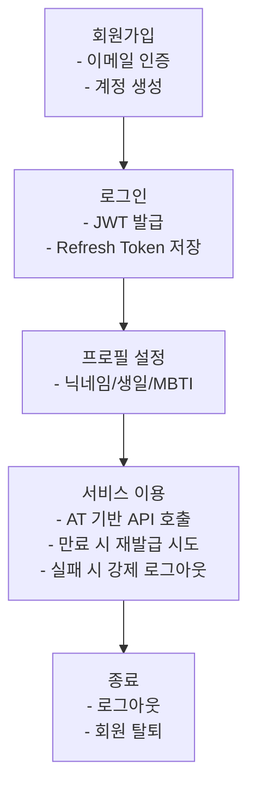

# 회원 관리 개요

MindMate의 회원 관리 시스템은 **사용자 생애주기(User Life Cycle)** 전체를 다루며 다음 기능으로 구성된다.

-   이메일 회원가입 + 이메일 인증 코드
-   JWT 기반 로컬 로그인
-   소셜 로그인(Kakao · Naver · Google)
-   프로필 정보·이미지 관리(S3)
-   Access/Refresh Token 재발급
-   로그아웃 및 회원 탈퇴(비식별 + 이미지 삭제)

모든 기능은 `User` 엔티티를 중심으로 동작하며,  
인증/인가는 **Spring Security + JWT 필터** 구조를 사용한다.

---

## 1. 구성 요소 & 세부 문서

| 구분                 | 내용                        | 상세 문서                                   |
| -------------------- | --------------------------- | ------------------------------------------- |
| **로컬 인증**        | 이메일·비밀번호 로그인, JWT | `[로컬 로그인 & JWT](auth-local-jwt.md)`    |
| **이메일 인증**      | 인증 코드 발송, 재시도 제한 | `[이메일 인증](auth-email.md)`              |
| **소셜 로그인**      | Kakao/Naver/Google OAuth    | `[소셜 로그인](auth-social.md)`             |
| **프로필 관리**      | 닉네임, 생일, MBTI, 캐릭터  | `[프로필 관리](profile.md)`                 |
| **S3 프로필 이미지** | 업로드/삭제, 리사이즈, 정리 | `[프로필 이미지 & S3](profile-image-s3.md)` |
| **JWT 인증 구조**    | AT/RT, Redis TTL, 재발급    | `[JWT 인증 구조](auth-jwt-flow.md)`         |
| **회원 탈퇴**        | 비식별, 데이터·이미지 삭제  | `[회원 탈퇴](account-delete.md)`            |

---

## 2. 전체 사용자 흐름

