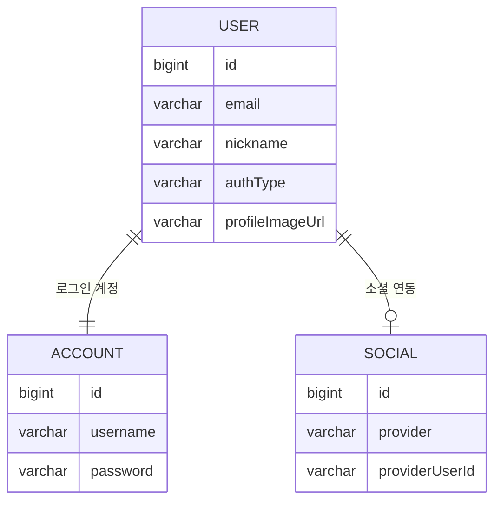
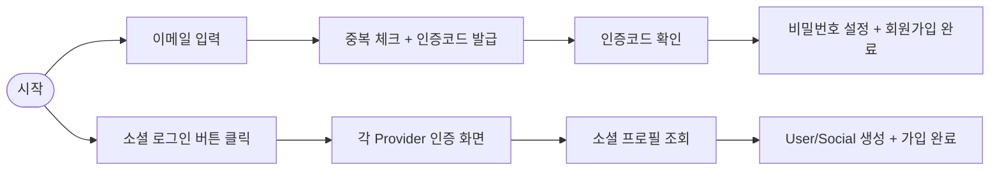
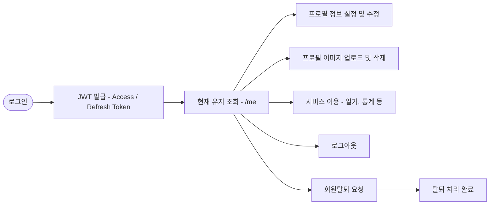
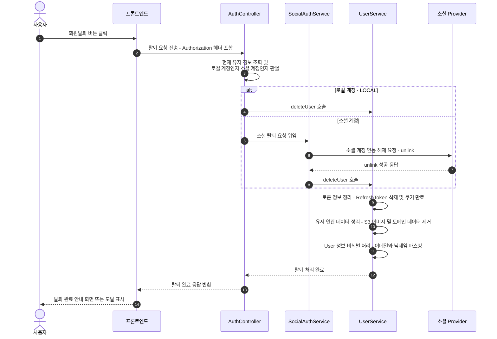

# 회원 관리 시스템 개요 (Account · User · Social)

> MindMate에서 구현한 **회원 관리 시스템 전체 구조**를 상위 수준에서 정리한 문서이다.
> 이 문서는 Account/User/Social 세 엔티티를 중심으로
> **회원가입 → 로그인 → 프로필 설정 → 소셜 연동 → 로그아웃/회원탈퇴**까지의 흐름을 한눈에 볼 수 있도록 정리한다.

---

## 1. 설계 목표

회원 관리 영역은 다음 세 가지 목표를 기준으로 설계했다.

1. **인증 정보와 서비스 프로필 분리**

    - 로그인 정보: `Account` (이메일/비밀번호)
    - 서비스 프로필: `User` (닉네임, 생일, MBTI, 프로필 이미지 등)

2. **로컬 계정과 소셜 계정의 일관된 처리**

    - Kakao/Naver/Google 계정은 `Social`로 통합 관리
    - 최종적으로 항상 **User 1개**에 귀속되는 구조

3. **유저 라이프사이클 단일 흐름**

    - “이메일 인증을 통과한 사용자 1명 = User 1개”를 기준으로
      가입, 로그인, 프로필, 소셜 연동, 탈퇴까지 **하나의 라이프사이클**로 관리

---

## 2. 주요 구성 요소 한눈에 보기

| 구분     | 이름                | 역할 요약                                                          |     |
| -------- | ------------------- | ------------------------------------------------------------------ | --- |
| 엔티티   | `Account`           | 로그인용 계정 정보(이메일/비밀번호)를 가지는 인증 계정             |     |
|          | `User`              | 닉네임·MBTI·생일·프로필 이미지 등 서비스 프로필 데이터             |     |
|          | `Social`            | Kakao/Naver/Google 계정과 User를 1:1로 연결하는 소셜 연동 엔티티   |     |
| 컨트롤러 | `AuthController`    | 회원가입, 로그인, JWT 재발급, 로그아웃, `/me`, 회원탈퇴 API        |     |
|          | `UserController`    | 프로필 정보 저장/수정, 닉네임 중복 확인, 프로필 이미지 업로드/삭제 |     |
| 서비스   | `AccountService`    | 회원가입/로그인/JWT 발급/유저 조회/로컬 회원탈퇴                   |     |
|          | `UserService`       | 프로필 정보 저장, 이미지 처리, 회원탈퇴 시 연관 리소스 정리        |     |
|          | `SocialAuthService` | 소셜 로그인·소셜 회원탈퇴 및 User/Social 생성·연결                 |     |

---

## 3. 핵심 엔티티 설계

### 3.1 User – 서비스 프로필의 중심 엔티티

`User`는 “MindMate에서 활동하는 실제 사용자”를 표현한다.

**주요 컬럼 (문서/ERD에서 기본으로 다루는 필드)**

-   `id`: PK (bigint)
-   `email`: 로그인/알림에 사용하는 이메일 (고유, not null)
-   `nickname`: 닉네임 (고유, 선택)
-   `birthDate`: 생년월일 (`LocalDate`)
-   `mbti`: MBTI 문자열
-   `authType`: 로그인 유형 (`LOCAL`, `KAKAO`, `NAVER`, `GOOGLE` 등)
-   `role`: 권한 (기본 `"USER"`)
-   `profileImageUrl`: 프로필 이미지 S3 URL

**관계**

-   `@OneToOne(mappedBy = "user") private Account account;`
-   `@OneToOne(mappedBy = "user", cascade = CascadeType.ALL) private Social social;`
-   그 외 일기/AI 관련 엔티티와의 관계는 **회원 관리 문서의 범위를 벗어나므로 이 문서에서는 상세 설명을 생략**한다.

**ERD에서 생략한 User 필드 예시**

가독성을 위해 ERD에는 User의 전체 필드를 모두 표기하지 않고,
다음과 같은 필드들은 텍스트 설명으로만 다룬다.

-   `birthDate`
-   `mbti`
-   `role`
-   `profileImageUrl`
-   일기/AI 관련 연관 필드들 (예: AICharacter, AIResult, Diary 등 도메인 엔티티와의 연관관계)

> 이 문서는 **회원 관리(인증·프로필)**에 직접 관련된 필드 중심으로 설명하며,
> 통계/AI/일기와 연결되는 필드는 도메인별 문서에서 다룬다.

---

### 3.2 Account – 로컬 로그인 계정

`Account`는 이메일/비밀번호 기반 **로컬 로그인 계정**을 관리하는 엔티티이다.

-   `id` (`account_id`): PK
-   `username`: 로그인 ID (이메일과 동일, unique, not null)
-   `password`: 암호화된 비밀번호

**관계**

-   `@OneToOne @JoinColumn(name = "user_id", nullable = false, unique = true)`
-   하나의 User에 정확히 하나의 Account만 연결된다.

> 인증/비밀번호 변경과 같은 **순수 로그인 관련 처리**는 Account 기준으로,
> 닉네임/MBTI/프로필 변경은 User 기준으로 처리한다.

---

### 3.3 Social – 소셜 계정 연동

`Social`은 Kakao/Naver/Google 계정과 User를 연결하는 소셜 연동 엔티티이다.

-   `id`: PK
-   `providerUserId`: 소셜 플랫폼 내 유저 고유 ID
-   `provider`: `"KAKAO"`, `"NAVER"`, `"GOOGLE"`

**제약**

-   `(provider, providerUserId)` Unique 제약

**관계**

-   `@OneToOne @JoinColumn(name = "user_id", nullable = false, unique = true)`
-   하나의 User는 **최대 하나의 Social** 계정과 연결된다.

---

### 3.4 Account · User · Social ERD (요약)

-   `USER` ↔ `ACCOUNT`: 정확히 1:1
-   `USER` ↔ `SOCIAL`: 0 또는 1 (소셜 연동이 없는 유저도 존재)

> ※ 위 ERD에서는 **관계 구조를 강조하기 위해 User의 일부 필드만 표기**했다.
> `birthDate`, `mbti`, `role` 등 나머지 컬럼은 3.1 User 섹션을 기준으로 이해하면 된다.

---

## 4. 유저 라이프사이클 상위 흐름

이 섹션은 상세 구현이 아니라,
**“사용자 입장에서 어떤 단계를 거치는지”**를 한 번에 보는 상위 개요이다.

### 4.1 회원가입 흐름 (이메일 · 소셜)

-   이메일 경로는 **이메일 인증 시스템 문서(`auth-email.md`)**가 상세 설명 담당
-   소셜 경로는 **소셜 로그인 문서(`auth-social.md`)**에서 Kakao/Naver/Google별 플로우를 다룬다.

---

### 4.2 로그인 이후 회원 관리 흐름

-   JWT 발급·검증·재발급 구조는 **`auth-jwt.md` + `auth-axios.md`** 문서에서 상세히 다룬다.
-   프로필 이미지 업로드/삭제는 **`auth-image.md`** 문서에서 전체 파이프라인을 설명한다.

---

### 4.3 회원탈퇴 상위 흐름 (로컬 · 소셜 공통)

-   소셜 탈퇴 시에는 먼저 Provider 쪽 **unlink** 후, 내부적으로 동일한 `deleteUser` 흐름으로 통합된다.

---

## 5. 기능별 상세 문서 맵

이 문서는 **“큰 그림과 엔티티 구조”**에 집중한다.
각 기능의 상세 구현은 아래 문서에서 다룬다.

| 영역           | 설명                                                 | 상세 문서        |
| -------------- | ---------------------------------------------------- | ---------------- |
| 이메일 인증    | 중복 체크, 인증코드 발급/검증, Redis + 세션 Fallback | `auth-email.md`  |
| JWT 인증       | AT/RT 생성, Redis 저장, 필터, 재발급, 로그아웃       | `auth-jwt.md`    |
| Axios 재발급   | 401 처리, 인터셉터, 리프레시 큐, 재시도 정책         | `auth-axios.md`  |
| 소셜 로그인    | Kakao/Naver/Google OAuth2, Social/User 생성·연결     | `auth-social.md` |
| 프로필 이미지  | 프론트 압축 → 백엔드 리사이즈 → S3 저장 → URL 관리   | `auth-image.md`  |
| 회원 관리 개요 | Account/User/Social 구조, 라이프사이클 상위 흐름     | **(현재 문서)**  |

---

## 6. 주요 API 상위 요약

상세 파라미터/응답 구조는 각 기능 문서를 참고하고,
여기서는 **“어떤 역할을 하는 API가 있는지”만 상위에서 정리**한다.

### 6.1 인증 영역 (`/api/auth`)

-   이메일 인증 + 회원가입:

    -   `GET /api/auth/check_username` – 이메일 중복 확인 + 인증코드 발급
    -   `POST /api/auth/check_code` – 인증코드 소프트 체크
    -   `POST /api/auth/signup` – 이메일/비밀번호 회원가입 + JWT 발급

-   로그인/토큰:

    -   `POST /api/auth/login` – 로컬 로그인 (AT/RT 발급)
    -   `POST /api/auth/refresh` – Access Token 재발급
    -   `POST /api/auth/logout` – RT 삭제 + 쿠키 만료
    -   `GET /api/auth/me` – 현재 로그인 유저 정보 조회

-   회원탈퇴:

    -   `POST /api/auth/delete` – 로컬 회원탈퇴
    -   `POST /api/auth/delete/{type}` – 소셜 회원탈퇴 (unlink + 내부 탈퇴)

-   소셜 로그인:

    -   `GET /api/auth/login/{type}` – Kakao/Naver/Google 로그인 콜백 처리

### 6.2 유저/프로필 영역 (`/api/user`)

-   프로필 정보:

    -   `POST /api/user` – 프로필 정보 최초 저장
    -   `PUT /api/user` – 프로필 정보 수정
    -   `GET /api/user/check_nickname` – 닉네임 중복 체크

-   프로필 이미지:

    -   `POST /api/user/profile-image` – 프로필 이미지 업로드/교체
    -   `POST /api/user/profile-image/delete` – 프로필 이미지 삭제

---

## 7. 정리

-   회원 관리 시스템은 **Account/User/Social을 축**으로,
    이메일/소셜 로그인, JWT 인증, 프로필/이미지, 회원탈퇴까지 전체 라이프사이클을 하나의 구조로 통합했다.
-   이 문서는 **엔티티 관계와 상위 흐름**에 집중하고,
    세부 구현은 각 기능별 문서(`auth-email`, `auth-jwt`, `auth-axios`, `auth-social`, `auth-image`)로 분리하여 **중복을 줄이고 역할을 명확히 나눈 구조**를 사용한다.
