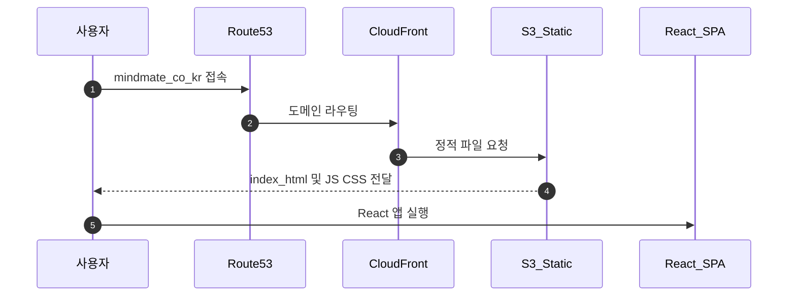
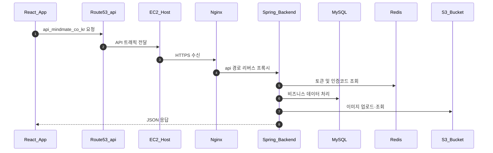
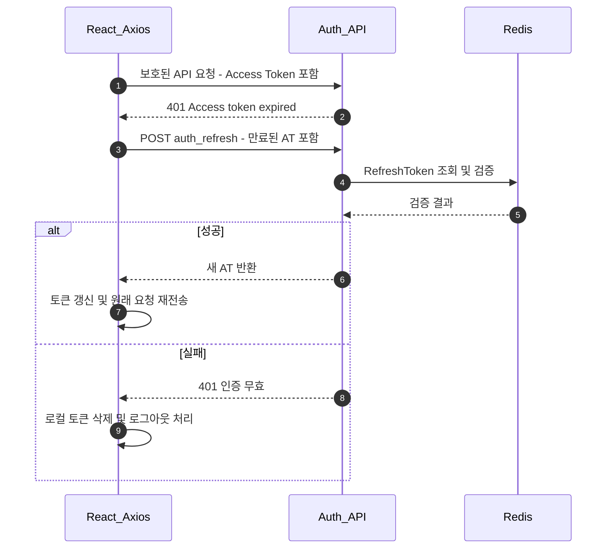
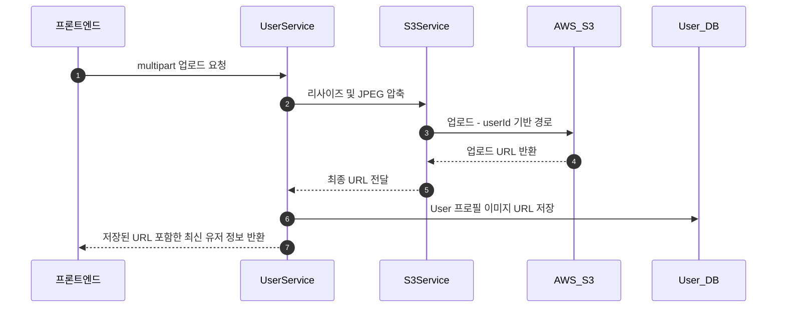

# 시스템 아키텍처

> MindMate는 **React 기반 SPA**,
> **Spring Boot 기반 백엔드 API**,
> 그리고 **AWS 인프라(EC2 · RDS · Redis · S3 · CloudFront · Route53)** 위에서 동작하는
> 감정 기록 및 AI 분석 중심의 개인 관리 서비스입니다.
>
> 이 문서는 전체 시스템을 **상위 수준 구조 + 핵심 요청 흐름** 중심으로 설명합니다.

---

# 1. 전체 구성 개요

MindMate는 다음 5개 계층으로 구성된다.

1. **Client Browser**
2. **Frontend SPA (React) — S3 + CloudFront**
3. **Backend API (Spring Boot) — Docker + EC2**
4. **Infra Services — RDS, Redis, S3**
5. **Network & Security — Nginx, SSL, Route53, VPC**

---

## 1-1. 구성 요소 상세

### ▶ Frontend (React SPA)

-   React 18 기반 SPA
-   React Router 라우팅
-   Axios 기반 API 통신
-   최종 빌드는 **S3에 업로드**, CloudFront를 통한 CDN 서빙

### ▶ Backend (Spring Boot API Server)

-   Spring Boot 3.x (Java 17)
-   Spring Security 기반 JWT 인증 구조
-   Docker 이미지로 빌드 후 EC2에 배포
-   주요 도메인: 회원관리, 일기/AI 분석, 커뮤니티, 통계, 이미지 업로드 등

### ▶ AWS 서비스 역할

| 서비스     | 역할                                           |
| ---------- | ---------------------------------------------- |
| EC2        | Docker Host, Nginx + Backend + Redis           |
| RDS        | 주요 영속 데이터 저장                          |
| Redis      | Refresh Token, 이메일 인증 코드 등 단기 데이터 |
| S3         | 프로필/일기 이미지 및 정적 리소스 저장         |
| CloudFront | 프론트 정적 리소스 CDN                         |
| Route53    | 도메인 관리                                    |
| Certbot    | SSL 인증서 자동 갱신                           |

---

# 2. 요청 흐름

정적 리소스와 동적 API는 서로 다른 경로와 인프라를 통해 처리된다.

---

## 2-1. React 정적 리소스 로딩



---

## 2-2. API 요청 흐름



---

# 3. 인증 아키텍처 (JWT + Redis)

MindMate 인증 흐름은 다음 요소로 구성된다.

### ① Access Token

-   짧은 유효시간
-   요청 시 Authorization 헤더로 전송

### ② Refresh Token

-   Redis에 `userId + accessToken + refreshToken` 형태로 저장
-   HttpOnly 쿠키로 전달
-   재발급 실패 시 즉시 무효 처리

### ③ Redis

-   RT TTL 기반 로그인 유지 관리
-   이메일 인증 코드 TTL 관리

---

## 3-1. 인증·재발급 흐름 요약



> 상세 로직은 `auth-jwt.md`, `auth-axios.md` 문서에 존재하므로 이 문서에서는 개요만 제공.

---

# 4. 이미지 처리 아키텍처

업로드 이미지는 **프론트 1차 압축 → 백엔드 리사이즈 → S3 저장**의 통일된 파이프라인으로 처리한다.

### 설계 원칙

-   DB에는 **이미지 URL만 저장**
-   백엔드에서 **해상도 통일(512px)** 및 **최종 JPEG 압축**
-   회원탈퇴 시 `profile/{userId}`, `diary/{userId}` 경로 전체 삭제

---

## 4-1. 이미지 업로드 흐름



---

# 5. 이메일 인증 아키텍처

-   인증 코드 TTL: 300초
-   요청 제한: 1시간 5회
-   메일 전송: `@Async` 비동기
-   Redis 장애 시 세션 기반 fallback

(상세 로직은 `auth-email.md` 참고)

---

# 6. 서버 인프라 구성 (EC2 + Docker + Nginx)

EC2 내 Docker Compose 구조:

```
EC2
 └─ docker-compose.yml
      ├─ mindmate-nginx        80, 443
      ├─ mindmate-backend      Spring Boot API
      └─ mindmate-redis        Redis
```

### Nginx 역할

-   HTTPS 종단 (SSL Termination)
-   `/api/**` → backend 프록시
-   Certbot 자동 갱신

### Backend 컨테이너

-   포트 8888에서 API 제공
-   `.env.prod` 환경 변수로 RDS/Redis/S3 설정 주입

---

# 7. 데이터 저장 구조 요약

### MySQL RDS

-   User, Account, Social
-   Diary, AIResult
-   Board, Comment, Like 등 핵심 도메인 저장

### Redis

-   Refresh Token
-   이메일 인증 코드
-   OAuth 임시 데이터

### S3

-   프로필 이미지
-   일기 이미지
-   정적 프론트 리소스 버킷

---

# 8. 설계 철학

### 1) 역할 분리

-   정적 리소스: S3 + CloudFront
-   동적 API: EC2 + Docker
-   인증/세션: Redis
-   이미지: S3
-   영속 데이터: RDS

### 2) 일관된 인증 구조

-   JWT + Redis 기반 AT/RT
-   프론트 Axios 인터셉터로 만료 + 재발급 자동 처리

### 3) 운영 효율성

-   Docker Compose로 배포 방식 통일
-   SSL 자동 갱신
-   유저별 S3 경로로 탈퇴 시 전체 청소 용이
