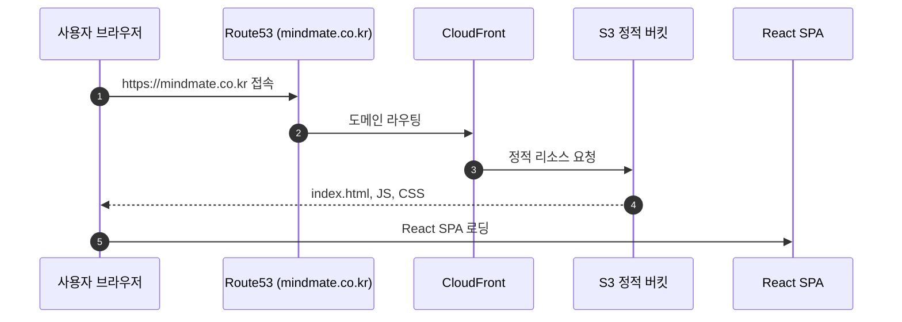
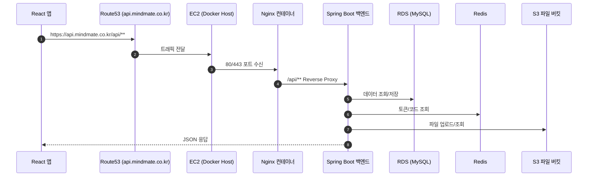

# 시스템 아키텍처

MindMate는 React 기반 프론트엔드와 Spring Boot 기반 백엔드 API 서버를 중심으로,  
AWS 인프라(EC2, RDS, S3, Redis, CloudFront, Route53, Nginx, Certbot) 위에 구성된 웹 서비스입니다.  
이 문서는 전체 시스템 구성을 한눈에 파악할 수 있도록 상위 레벨의 아키텍처를 정리합니다.

---

## 1. 전체 시스템 구성

### 1-1. 주요 구성 요소

-   **클라이언트**

    -   웹 브라우저(PC / 모바일)

-   **프론트엔드**

    -   React Single Page Application
    -   정적 리소스: S3 + CloudFront를 통한 배포

-   **백엔드 API 서버**

    -   Spring Boot 3.x
    -   Docker 컨테이너로 EC2에 배포
    -   REST API 제공 (`/api/**`)

-   **데이터베이스**

    -   AWS RDS(MySQL)
    -   회원, 일기, 게시글, 통계 등 영속 데이터 저장

-   **캐시 / 단기 데이터 저장소**

    -   Redis
    -   토큰 및 단기성 데이터 관리

-   **파일 스토리지**

    -   AWS S3
    -   프로필 이미지 등 업로드 파일 저장

-   **네트워크 / 보안 / 라우팅**
    -   AWS EC2
    -   Nginx Reverse Proxy
    -   Route53 (도메인 관리)
    -   CloudFront (정적 자원 CDN)
    -   Certbot (SSL 인증서 발급 및 갱신)

---

## 2. 요청 흐름 개요

### 2-1. 화면 로딩 흐름

1. 사용자가 `https://mindmate.co.kr` 접속
2. **Route53**이 도메인을 CloudFront에 매핑
3. **CloudFront**가 정적 리소스를 **S3 정적 호스팅 버킷**에서 가져와 React 앱 전달
4. 브라우저에서 React SPA 구동

### 2-2. API 요청 흐름

1. React 앱에서 `https://api.mindmate.co.kr/api/**`로 API 호출
2. **Route53** → **EC2 인스턴스**로 트래픽 전달
3. EC2 내 **Nginx**가 `/api/**` 요청을 백엔드 컨테이너(Spring Boot)로 Reverse Proxy
4. 백엔드는 필요에 따라 **RDS**, **Redis**, **S3**와 통신 후 응답 반환

> 인증/토큰 처리, 소셜 로그인 흐름 등은  
> `회원관리 상세` 섹션에서 별도 문서로 상세히 다룹니다.

---

## 3. 서버 및 인프라 구성

### 3-1. EC2 내부 구성

-   Docker + Docker Compose 환경
-   주요 컨테이너

    -   `mindmate-nginx` (nginx)
        -   80 / 443 포트 수신
        -   `/etc/nginx/conf.d` 마운트
        -   Certbot용 웹 루트(`/var/www/certbot`) 및 인증서(`/etc/letsencrypt`) 볼륨 마운트
    -   `mindmate-backend`
        -   Spring Boot 3.x 애플리케이션
        -   8888 포트로 동작
        -   `.env.prod` 환경 변수를 통해 RDS, Redis, S3 설정 주입
    -   `mindmate-redis`
        -   Redis 7
        -   인증/이메일 코드 등 단기성 데이터 저장

-   컨테이너 간 역할
    -   `mindmate-nginx` 컨테이너가 외부에서 들어오는 HTTPS 요청을 수신
    -   `/api/**` 요청을 Docker 네트워크 내부의 `mindmate-backend:8888`으로 Reverse Proxy
    -   SSL 인증서는 Nginx 컨테이너에 마운트된 Certbot 디렉터리(`/etc/letsencrypt`)에서 관리

### 3-2. 데이터베이스 & 캐시

-   **RDS(MySQL)**

    -   백엔드 애플리케이션만 접근 가능하도록 보안 그룹 제한
    -   회원, 일기, 게시글, 통계 등 주요 도메인 저장

-   **Redis**
    -   토큰 및 단기성 데이터(예: 인증 코드 등) 저장
    -   TTL 기반 만료 관리

### 3-3. 파일 스토리지

-   **S3**
    -   프로필 이미지 등 사용자 업로드 파일 저장
    -   백엔드에서 업로드·삭제를 담당
    -   정적 프론트 배포용 버킷은 CloudFront와 연결

---

## 4. 데이터 저장 구조 개요

-   **MySQL(RDS)**

    -   핵심 비즈니스 데이터의 영구 저장소
    -   JPA를 통해 엔티티 단위로 접근

-   **Redis**

    -   만료가 필요한 토큰/코드 등 단기 데이터 저장
    -   빠른 조회가 필요한 인증 관련 데이터 위주로 사용

-   **S3**
    -   이미지 파일처럼 용량이 크고, 이진 형태의 데이터를 저장
    -   DB에는 S3 객체 경로/URL만 보관

---

## 5. 설계 의도 요약

-   **역할 분리**

    -   프론트(React)와 백엔드(Spring Boot)를 명확히 분리
    -   정적 자원은 S3 + CloudFront로 오프로드하여 API 서버 부하 감소

-   **보안**

    -   모든 외부 트래픽은 HTTPS를 통해 전달
    -   인증/토큰 관리, 환경 변수 분리 등은 회원관리·배포 문서에서 상세 설명

-   **운영 및 확장성**
    -   Docker 기반으로 배포 환경 표준화
    -   Redis, RDS, S3 등 매니지드 서비스를 활용해 확장과 운영 부담 최소화
    -   EC2 스펙 증설, 컨테이너 확장 등을 통해 트래픽 증가에 대응 가능

---

> 이 문서는 MindMate의 **전체 구조를 상위 레벨에서 이해하기 위한 아키텍처 개요**입니다.  
> 인증/인가, 소셜 로그인, 프로필 이미지(S3), Axios 인터셉터, 배포 절차 등 세부 구현 내용은  
> 각각의 기능별 상세 문서에서 이어서 설명합니다.
